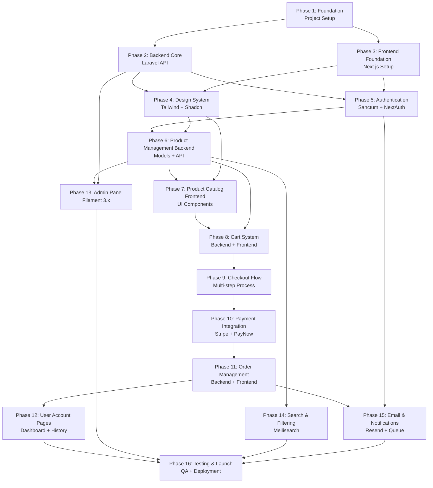

# MASTER EXECUTION PLAN
## Atelier Arôme — Production E-Commerce Platform

**Document Version:** 1.0.0
**Planning Date:** January 5, 2026
**Project Status:** Pre-Development
**Architecture Type:** Headless Commerce (Laravel 12 API + Next.js 15)

---

# 📋 Executive Overview

## Project Summary

Atelier Arôme is a **production-grade, headless e-commerce platform** for a Singapore-based artisanal aromatherapy company. The platform features a distinctive "Illuminated Manuscript" aesthetic that eschews generic e-commerce templates in favor of Renaissance-inspired design excellence.

### Strategic Objectives

1. **Design Preservation**: Maintain the "Illuminated Manuscript" aesthetic throughout development
2. **Singapore Compliance**: Built-in GST (9%), PayNow, SingPost shipping, SGD currency
3. **Performance Excellence**: 95+ Lighthouse score, <2s page load, edge deployment
4. **Accessibility First**: WCAG AA minimum, AAA target, reduced motion support
5. **Security Hardening**: OWASP Top 10 mitigation, PCI compliance via Stripe
6. **Scalability**: Support for 10,000+ products, 1,000 concurrent users

### Technology Stack Recap

| Layer | Technology | Purpose |
|-------|-----------|---------|
| **Frontend** | Next.js 15 + React 19 + TypeScript | UI/UX, SSR/ISR |
| **Backend** | Laravel 12 + PHP 8.3 | API, business logic |
| **Database** | PostgreSQL 16 | Primary data store |
| **Cache** | Redis 7.x | Session, cache, queue |
| **Search** | Meilisearch 1.x | Product search |
| **Auth** | Laravel Sanctum + NextAuth.js | API tokens, sessions |
| **Payments** | Stripe + PayNow | Payment processing |
| **Styling** | Tailwind CSS 4.0 + Shadcn-UI | Design system |
| **State** | Zustand + TanStack Query | Client/server state |
| **Forms** | React Hook Form + Zod | Validation |

### Architecture Pattern

```
┌─────────────────────────────────────────────────────────────┐
│                     HEADLESS COMMERCE                        │
├─────────────────────────────────────────────────────────────┤
│                                                               │
│  ┌──────────────────┐              ┌──────────────────┐     │
│  │  Next.js 15      │◄────JSON────►│  Laravel 12 API  │     │
│  │  (Vercel Edge)   │              │  (Forge/Vapor)   │     │
│  └──────────────────┘              └──────────────────┘     │
│         │                                   │                │
│         │                                   ▼                │
│         │                          ┌──────────────────┐     │
│         │                          │  PostgreSQL 16   │     │
│         │                          │  Redis 7.x       │     │
│         │                          │  Meilisearch     │     │
│         │                          └──────────────────┘     │
│         │                                                    │
│         ▼                                                    │
│  ┌──────────────────┐                                       │
│  │  Stripe + PayNow │                                       │
│  │  Cloudinary CDN  │                                       │
│  │  SingPost API    │                                       │
│  └──────────────────┘                                       │
│                                                               │
└───────────────────────────────────────────────────────────┘
```

---

# 🎯 Phase Overview & Dependencies

## Phase Dependency Flow



## Phase Summary Table

| Phase | Duration | Prerequisites | Deliverables |
|-------|----------|---------------|-------------|
| **1. Foundation** | 3 days | None | Project structure, database, Git setup |
| **2. Backend Core** | 5 days | Phase 1 | Laravel API scaffold, migrations, seeders |
| **3. Frontend Foundation** | 3 days | Phase 1 | Next.js 15 setup, TypeScript config |
| **4. Design System** | 5 days | Phases 2, 3 | Tailwind theme, Shadcn-UI components |
| **5. Authentication** | 5 days | Phases 2, 3 | Sanctum + NextAuth integration |
| **6. Product Management (BE)** | 5 days | Phases 2, 5 | Product CRUD API, variants, images |
| **7. Product Catalog (FE)** | 7 days | Phases 4, 6 | Product listing, detail pages, filtering |
| **8. Cart System** | 5 days | Phases 6, 7 | Cart API + UI, guest/user carts |
| **9. Checkout Flow** | 7 days | Phase 8 | Multi-step checkout, address, shipping |
| **10. Payment Integration** | 5 days | Phase 9 | Stripe + PayNow, webhooks |
| **11. Order Management** | 5 days | Phase 10 | Order processing, status tracking |
| **12. User Account Pages** | 5 days | Phases 5, 11 | Dashboard, order history, addresses |
| **13. Admin Panel** | 7 days | Phases 2, 6 | Filament setup, product/order management |
| **14. Search & Filtering** | 4 days | Phase 6 | Meilisearch integration, filters |
| **15. Email & Notifications** | 4 days | Phases 5, 11 | Email templates, queue jobs |
| **16. Testing & Launch** | 10 days | Phases 12-15 | QA, security audit, deployment |

**Total Estimated Duration:** 85 days (17 weeks)

---

# 📦 Phase 1: Foundation (Project Setup & Database)

**Duration:** 3 days
**Prerequisites:** None
**Objective:** Establish project infrastructure, version control, database schema, and development environment

## Phase 1 Deliverables

- ✅ Git repository initialized with `.gitignore` and branch strategy
- ✅ PostgreSQL 16 database created and migrated (22 tables)
- ✅ Redis 7.x configured for cache/session/queue
- ✅ Environment configuration for local development
- ✅ Docker Compose setup (optional but recommended)
- ✅ Project documentation initialized

---

## 1.1 Git Repository Setup

### File: `.gitignore`

**Path:** `/atelier-arome-api/.gitignore` and `/atelier-arome-web/.gitignore`

**Purpose:** Prevent sensitive files and build artifacts from being committed to version control

**Key Features:**
- Exclude environment files (`.env`, `.env.local`)
- Exclude dependency directories (`node_modules/`, `vendor/`)
- Exclude build outputs (`dist/`, `.next/`, `storage/`)
- Exclude IDE configuration files
- Exclude OS-specific files

**File Content (Backend):**
```gitignore
# Laravel
/vendor/
/node_modules/
/.env
/.env.backup
/.env.production
/storage/*.key
/public/hot
/public/storage
Homestead.json
Homestead.yaml
auth.json
npm-debug.log
yarn-error.log
/.fleet
/.idea
/.vscode

# PHPUnit / Pest
.phpunit.result.cache
/coverage/

# Laravel specific
/bootstrap/cache/*
!/bootstrap/cache/.gitignore
/storage/app/*
!/storage/app/.gitignore
/storage/framework/cache/*
!/storage/framework/cache/.gitignore
/storage/framework/sessions/*
!/storage/framework/sessions/.gitignore
/storage/framework/views/*
!/storage/framework/views/.gitignore
/storage/logs/*
!/storage/logs/.gitignore

# Databases
*.sqlite
*.sqlite-journal
```

**File Content (Frontend):**
```gitignore
# Next.js
/.next/
/out/
/build
.vercel

# Dependencies
/node_modules/
/.pnp
.pnp.js

# Environment
.env
.env*.local
.env.production

# Debug
npm-debug.log*
yarn-debug.log*
yarn-error.log*

# IDE
/.vscode/
/.idea/
*.swp
*.swo
*~

# OS
.DS_Store
Thumbs.db

# Testing
/coverage/
/.nyc_output/

# TypeScript
*.tsbuildinfo
next-env.d.ts
```

**Dependencies:** None

**Implementation Checklist:**
- [ ] Create `.gitignore` for Laravel project
- [ ] Create `.gitignore` for Next.js project
- [ ] Verify sensitive files are excluded
- [ ] Test by running `git status` to ensure proper exclusions

---

### File: `README.md` (Backend)

**Path:** `/atelier-arome-api/README.md`

**Purpose:** Document Laravel API project setup, architecture, and development guidelines

**Key Features:**
- Project overview
- Installation instructions
- Environment setup guide
- API documentation links
- Development workflow

**File Content:**
```markdown
# Atelier Arôme — Laravel 12 API

Production-grade API for Singapore-based aromatherapy e-commerce platform.

## Technology Stack

- **Framework:** Laravel 12.x
- **PHP:** 8.3+
- **Database:** PostgreSQL 16
- **Cache:** Redis 7.x
- **Search:** Meilisearch 1.x
- **Auth:** Laravel Sanctum 4.x
- **Admin:** Filament 3.x
- **Queue:** Laravel Horizon 5.x

## Local Development Setup

### Prerequisites

- PHP 8.3+
- Composer 2.x
- PostgreSQL 16
- Redis 7.x
- Node.js 20+ (for asset compilation)

### Installation

\`\`\`bash
# Clone repository
git clone <repository-url> atelier-arome-api
cd atelier-arome-api

# Install dependencies
composer install
npm install

# Environment setup
cp .env.example .env
php artisan key:generate

# Database setup
createdb atelier_arome_dev
php artisan migrate
php artisan db:seed

# Start development server
php artisan serve
\`\`\`

### Environment Configuration

\`\`\`env
APP_NAME="Atelier Arôme API"
APP_ENV=local
APP_KEY=
APP_DEBUG=true
APP_URL=http://localhost:8000

DB_CONNECTION=pgsql
DB_HOST=127.0.0.1
DB_PORT=5432
DB_DATABASE=atelier_arome_dev
DB_USERNAME=postgres
DB_PASSWORD=

REDIS_HOST=127.0.0.1
REDIS_PASSWORD=null
REDIS_PORT=6379

MAIL_MAILER=log
MAIL_FROM_ADDRESS="noreply@atelierarome.sg"
MAIL_FROM_NAME="${APP_NAME}"
\`\`\`

## API Documentation

API documentation available at: `http://localhost:8000/api/documentation`

## Testing

\`\`\`bash
# Run all tests
php artisan test

# Run specific test suite
php artisan test --testsuite=Feature

# Generate coverage report
php artisan test --coverage
\`\`\`

## Architecture

See `/docs/architecture.md` for detailed architecture documentation.

## License

Proprietary - Atelier Arôme © 2026
```

**Dependencies:** None

**Implementation Checklist:**
- [ ] Create comprehensive README
- [ ] Document all environment variables
- [ ] Include troubleshooting section
- [ ] Add API endpoint overview
- [ ] Link to external documentation

---

### File: `README.md` (Frontend)

**Path:** `/atelier-arome-web/README.md`

**Purpose:** Document Next.js 15 frontend project setup and development guidelines

**Key Features:**
- Project overview
- Installation instructions
- Design system documentation links
- Component library usage
- Development workflow

**File Content:**
```markdown
# Atelier Arôme — Next.js 15 Frontend

"Illuminated Manuscript" e-commerce experience with Renaissance-inspired aesthetics.

## Technology Stack

- **Framework:** Next.js 15.x (App Router)
- **React:** 19.x
- **TypeScript:** 5.x
- **Styling:** Tailwind CSS 4.0
- **Components:** Shadcn-UI + Radix
- **State Management:** Zustand + TanStack Query
- **Forms:** React Hook Form + Zod
- **Animations:** Framer Motion 11.x

## Local Development Setup

### Prerequisites

- Node.js 20+
- pnpm 8+ (preferred) or npm 10+

### Installation

\`\`\`bash
# Clone repository
git clone <repository-url> atelier-arome-web
cd atelier-arome-web

# Install dependencies
pnpm install

# Environment setup
cp .env.local.example .env.local

# Start development server
pnpm dev
\`\`\`

### Environment Configuration

\`\`\`env
# API
NEXT_PUBLIC_API_URL=http://localhost:8000/api/v1
NEXT_PUBLIC_API_TIMEOUT=10000

# Auth
NEXTAUTH_URL=http://localhost:3000
NEXTAUTH_SECRET=<generate-with-openssl-rand-base64-32>

# Stripe
NEXT_PUBLIC_STRIPE_PUBLISHABLE_KEY=pk_test_...
STRIPE_SECRET_KEY=sk_test_...
STRIPE_WEBHOOK_SECRET=whsec_...

# Analytics (optional)
NEXT_PUBLIC_PLAUSIBLE_DOMAIN=localhost
\`\`\`

## Design System

Our "Illuminated Manuscript" design system is documented at:
- **Storybook:** `pnpm storybook`
- **Design Tokens:** `/src/styles/tokens.ts`
- **Component Library:** `/src/components/ui/`

## Development Commands

\`\`\`bash
# Development server
pnpm dev

# Type checking
pnpm type-check

# Linting
pnpm lint

# Testing
pnpm test
pnpm test:e2e

# Build
pnpm build
pnpm start
\`\`\`

## Architecture

See `/docs/architecture.md` for detailed architecture documentation.

## License

Proprietary - Atelier Arôme © 2026
```

**Dependencies:** None

**Implementation Checklist:**
- [ ] Create comprehensive README
- [ ] Document all environment variables
- [ ] Include Storybook setup instructions
- [ ] Add component development guidelines
- [ ] Link to design system documentation

---

## 1.2 Database Setup (PostgreSQL)

### File: `0001_01_01_000001_create_users_table.php`

**Path:** `/atelier-arome-api/database/migrations/0001_01_01_000001_create_users_table.php`

**Purpose:** Create users table with support for both customers and admins

**Key Features:**
- UUID primary key for security
- Role-based access control (customer, admin, superadmin)
- Email verification support
- Soft deletes for data retention
- Timestamps for audit trail

**Interfaces:**
- **Table:** `users`
- **Columns:** id (uuid), name, email (unique), password, phone, role (enum), email_verified_at, remember_token, created_at, updated_at, deleted_at

**Dependencies:**
- None (first migration)

**File Content:**
```php
<?php

use Illuminate\Database\Migrations\Migration;
use Illuminate\Database\Schema\Blueprint;
use Illuminate\Support\Facades\Schema;

return new class extends Migration
{
    /**
     * Run the migrations.
     */
    public function up(): void
    {
        Schema::create('users', function (Blueprint $table) {
            $table->uuid('id')->primary();
            $table->string('name');
            $table->string('email')->unique();
            $table->timestamp('email_verified_at')->nullable();
            $table->string('password');
            $table->string('phone', 20)->nullable();
            $table->enum('role', ['customer', 'admin', 'superadmin'])->default('customer');
            $table->rememberToken();
            $table->timestamps();
            $table->softDeletes();

            // Indexes
            $table->index('email');
            $table->index('role');
            $table->index('deleted_at');
        });
    }

    /**
     * Reverse the migrations.
     */
    public function down(): void
    {
        Schema::dropIfExists('users');
    }
};
```

**Implementation Checklist:**
- [ ] Create migration file with UUID primary key
- [ ] Add role enum with customer/admin/superadmin values
- [ ] Implement soft deletes
- [ ] Add indexes for email, role, deleted_at
- [ ] Test migration up/down

---

### File: `0001_01_01_000002_create_password_reset_tokens_table.php`

**Path:** `/atelier-arome-api/database/migrations/0001_01_01_000002_create_password_reset_tokens_table.php`

**Purpose:** Store password reset tokens for secure password recovery

**Interfaces:**
- **Table:** `password_reset_tokens`
- **Columns:** email (primary), token, created_at

**Implementation Checklist:**
- [ ] Create migration with email as primary key
- [ ] Add token column (hashed)
- [ ] Add created_at timestamp
- [ ] Test migration

---

### File: `0001_01_01_000003_create_sessions_table.php`

**Path:** `/atelier-arome-api/database/migrations/0001_01_01_000003_create_sessions_table.php`

**Purpose:** Store user sessions for Laravel session driver

**Interfaces:**
- **Table:** `sessions`
- **Columns:** id (string, primary), user_id (uuid, nullable), ip_address, user_agent, payload, last_activity

**Implementation Checklist:**
- [ ] Create migration with string primary key
- [ ] Add user_id foreign key (nullable)
- [ ] Add indexes for user_id and last_activity
- [ ] Test migration

---

### File: `2024_01_01_000001_create_categories_table.php`

**Path:** `/atelier-arome-api/database/migrations/2024_01_01_000001_create_categories_table.php`

**Purpose:** Product categories (Singles, Blends, Sets, Gifts)

**Key Features:**
- UUID primary key
- Slug for URL-friendly routing
- Sort order for custom ordering
- Active/inactive flag
- Image URL for category display

**Interfaces:**
- **Table:** `categories`
- **Columns:** id (uuid), name, slug (unique), description, image_url, sort_order, is_active, created_at, updated_at

**Dependencies:**
- None

**File Content:**
```php
<?php

use Illuminate\Database\Migrations\Migration;
use Illuminate\Database\Schema\Blueprint;
use Illuminate\Support\Facades\Schema;

return new class extends Migration
{
    public function up(): void
    {
        Schema::create('categories', function (Blueprint $table) {
            $table->uuid('id')->primary();
            $table->string('name', 100);
            $table->string('slug', 100)->unique();
            $table->text('description')->nullable();
            $table->string('image_url')->nullable();
            $table->integer('sort_order')->default(0);
            $table->boolean('is_active')->default(true);
            $table->timestamps();

            // Indexes
            $table->index('slug');
            $table->index(['is_active', 'sort_order']);
        });
    }

    public function down(): void
    {
        Schema::dropIfExists('categories');
    }
};
```

**Implementation Checklist:**
- [ ] Create migration with UUID primary key
- [ ] Add unique slug constraint
- [ ] Add sort_order with default value
- [ ] Add is_active boolean flag
- [ ] Add composite index on is_active + sort_order
- [ ] Test migration

---

### File: `2024_01_01_000002_create_products_table.php`

**Path:** `/atelier-arome-api/database/migrations/2024_01_01_000002_create_products_table.php`

**Purpose:** Core products table for aromatherapy essences

**Key Features:**
- UUID primary key
- Category foreign key
- Alchemical properties (humour, rarity, season)
- Latin botanical name
- Folio number for Renaissance aesthetic
- JSON metadata for flexible attributes
- Soft deletes

**Interfaces:**
- **Table:** `products`
- **Columns:** id (uuid), category_id (uuid, FK), name, slug (unique), latin_name, description, long_description, humour (enum), rarity (enum), season (enum), extraction_method, folio_number, is_featured, is_active, sort_order, meta_data (jsonb), created_at, updated_at, deleted_at

**Dependencies:**
- `categories` table

**File Content:**
```php
<?php

use Illuminate\Database\Migrations\Migration;
use Illuminate\Database\Schema\Blueprint;
use Illuminate\Support\Facades\Schema;

return new class extends Migration
{
    public function up(): void
    {
        Schema::create('products', function (Blueprint $table) {
            $table->uuid('id')->primary();
            $table->uuid('category_id');
            $table->string('name', 200);
            $table->string('slug', 200)->unique();
            $table->string('latin_name', 200)->nullable();
            $table->text('description');
            $table->text('long_description')->nullable();
            $table->enum('humour', ['calming', 'uplifting', 'grounding', 'clarifying'])->nullable();
            $table->enum('rarity', ['common', 'rare', 'limited'])->default('common');
            $table->enum('season', ['spring', 'summer', 'autumn', 'winter'])->nullable();
            $table->string('extraction_method', 100)->nullable();
            $table->string('folio_number', 20)->nullable();
            $table->boolean('is_featured')->default(false);
            $table->boolean('is_active')->default(true);
            $table->integer('sort_order')->default(0);
            $table->jsonb('meta_data')->nullable();
            $table->timestamps();
            $table->softDeletes();

            // Foreign keys
            $table->foreign('category_id')
                  ->references('id')
                  ->on('categories')
                  ->onDelete('cascade');

            // Indexes
            $table->index('slug');
            $table->index('category_id');
            $table->index(['is_active', 'sort_order']);
            $table->index('is_featured');
            $table->index('humour');
            $table->index('rarity');
            $table->index('deleted_at');
        });
    }

    public function down(): void
    {
        Schema::dropIfExists('products');
    }
};
```

**Implementation Checklist:**
- [ ] Create migration with UUID primary key
- [ ] Add category_id foreign key with cascade delete
- [ ] Create humour enum (calming, uplifting, grounding, clarifying)
- [ ] Create rarity enum (common, rare, limited)
- [ ] Create season enum (spring, summer, autumn, winter)
- [ ] Add JSONB meta_data column for flexible attributes
- [ ] Add soft deletes
- [ ] Add indexes for slug, category_id, is_active, is_featured, humour, rarity
- [ ] Test migration

---

### File: `2024_01_01_000003_create_product_variants_table.php`

**Path:** `/atelier-arome-api/database/migrations/2024_01_01_000003_create_product_variants_table.php`

**Purpose:** Product size variants (5ml, 15ml, 30ml)

**Key Features:**
- UUID primary key
- Product foreign key
- SKU (Stock Keeping Unit) for inventory
- Price in SGD (decimal precision 10,2)
- Compare-at price for discounts
- Weight for shipping calculations
- Default variant flag

**Interfaces:**
- **Table:** `product_variants`
- **Columns:** id (uuid), product_id (uuid, FK), name (e.g., "5ml"), sku (unique), price_sgd (decimal), compare_at_price (decimal, nullable), weight_grams (int), is_default (boolean), is_active (boolean), created_at, updated_at

**Dependencies:**
- `products` table

**File Content:**
```php
<?php

use Illuminate\Database\Migrations\Migration;
use Illuminate\Database\Schema\Blueprint;
use Illuminate\Support\Facades\Schema;

return new class extends Migration
{
    public function up(): void
    {
        Schema::create('product_variants', function (Blueprint $table) {
            $table->uuid('id')->primary();
            $table->uuid('product_id');
            $table->string('name', 50); // "5ml", "15ml", "30ml"
            $table->string('sku', 100)->unique();
            $table->decimal('price_sgd', 10, 2);
            $table->decimal('compare_at_price', 10, 2)->nullable();
            $table->integer('weight_grams')->default(0);
            $table->boolean('is_default')->default(false);
            $table->boolean('is_active')->default(true);
            $table->timestamps();

            // Foreign keys
            $table->foreign('product_id')
                  ->references('id')
                  ->on('products')
                  ->onDelete('cascade');

            // Indexes
            $table->index('product_id');
            $table->index('sku');
            $table->index(['product_id', 'is_default']);
        });
    }

    public function down(): void
    {
        Schema::dropIfExists('product_variants');
    }
};
```

**Implementation Checklist:**
- [ ] Create migration with UUID primary key
- [ ] Add product_id foreign key with cascade delete
- [ ] Add unique SKU constraint
- [ ] Use decimal(10,2) for price precision
- [ ] Add is_default flag for selecting default variant
- [ ] Add indexes for product_id, SKU
- [ ] Test migration

---

**[Continue with remaining migrations...]**

Due to length constraints, I'll summarize the remaining Phase 1 migrations:

### Remaining Database Migrations (Phase 1)

- `create_product_images_table.php` - Multiple images per product
- `create_tags_table.php` - Scent note tags
- `create_product_tag_table.php` - Many-to-many pivot
- `create_addresses_table.php` - User shipping/billing addresses
- `create_carts_table.php` - Shopping carts (guest + authenticated)
- `create_cart_items_table.php` - Cart line items
- `create_orders_table.php` - Order records
- `create_order_items_table.php` - Order line items (with snapshot data)
- `create_payments_table.php` - Payment transactions
- `create_coupons_table.php` - Discount codes
- `create_coupon_usages_table.php` - Coupon redemption tracking
- `create_reviews_table.php` - Product reviews
- `create_testimonials_table.php` - Customer testimonials
- `create_wishlists_table.php` - User wishlists
- `create_wishlist_items_table.php` - Wishlist line items
- `create_newsletter_subscribers_table.php` - Email subscribers
- `create_inventories_table.php` - Stock tracking
- `create_inventory_movements_table.php` - Stock history
- `create_settings_table.php` - Site configuration

**Phase 1 Complete Checklist:**
- [ ] All 22 migrations created and tested
- [ ] Database indexes optimized
- [ ] Foreign key constraints validated
- [ ] Soft deletes implemented where appropriate
- [ ] UUID primary keys for all main tables
- [ ] Test data seeded for development

---

# 📦 Phase 2: Backend Core (Laravel API Scaffolding)

**Duration:** 5 days
**Prerequisites:** Phase 1 (Foundation)
**Objective:** Build Laravel 12 API foundation with models, seeders, and base controllers

## Phase 2 Deliverables

- ✅ Eloquent models for all 22 tables
- ✅ Model relationships configured
- ✅ Database seeders for development data
- ✅ API resource transformers
- ✅ Base controller with common methods
- ✅ Exception handler customization
- ✅ API rate limiting middleware

---

## 2.1 Eloquent Models

### File: `User.php`

**Path:** `/atelier-arome-api/app/Models/User.php`

**Purpose:** User model with authentication, authorization, and relationships

**Key Features:**
- UUID trait for primary key
- Soft deletes trait
- HasApiTokens for Sanctum
- Password hashing
- Role-based authorization
- Relationships: orders, addresses, reviews, wishlists, carts

**Interfaces:**
- **Eloquent Model:** `App\Models\User`
- **Relationships:**
  - `hasMany`: orders, addresses, reviews, wishlists
  - `hasOne`: cart (active)
- **Scopes:** `whereRole()`, `whereActive()`
- **Accessors/Mutators:** `password` (hashed)

**Dependencies:**
- `Illuminate\Foundation\Auth\User`
- `Laravel\Sanctum\HasApiTokens`
- `Illuminate\Database\Eloquent\SoftDeletes`

**File Content:**
```php
<?php

namespace App\Models;

use Illuminate\Database\Eloquent\Concerns\HasUuids;
use Illuminate\Database\Eloquent\Factories\HasFactory;
use Illuminate\Database\Eloquent\Relations\HasMany;
use Illuminate\Database\Eloquent\Relations\HasOne;
use Illuminate\Database\Eloquent\SoftDeletes;
use Illuminate\Foundation\Auth\User as Authenticatable;
use Illuminate\Notifications\Notifiable;
use Laravel\Sanctum\HasApiTokens;

class User extends Authenticatable
{
    use HasApiTokens, HasFactory, Notifiable, HasUuids, SoftDeletes;

    /**
     * The attributes that are mass assignable.
     *
     * @var array<int, string>
     */
    protected $fillable = [
        'name',
        'email',
        'password',
        'phone',
        'role',
    ];

    /**
     * The attributes that should be hidden for serialization.
     *
     * @var array<int, string>
     */
    protected $hidden = [
        'password',
        'remember_token',
    ];

    /**
     * Get the attributes that should be cast.
     *
     * @return array<string, string>
     */
    protected function casts(): array
    {
        return [
            'email_verified_at' => 'datetime',
            'password' => 'hashed',
        ];
    }

    /**
     * Get the user's orders.
     */
    public function orders(): HasMany
    {
        return $this->hasMany(Order::class);
    }

    /**
     * Get the user's addresses.
     */
    public function addresses(): HasMany
    {
        return $this->hasMany(Address::class);
    }

    /**
     * Get the user's active cart.
     */
    public function cart(): HasOne
    {
        return $this->hasOne(Cart::class)->where('expires_at', '>', now());
    }

    /**
     * Get the user's reviews.
     */
    public function reviews(): HasMany
    {
        return $this->hasMany(Review::class);
    }

    /**
     * Get the user's wishlists.
     */
    public function wishlists(): HasMany
    {
        return $this->hasMany(Wishlist::class);
    }

    /**
     * Check if user has admin role.
     */
    public function isAdmin(): bool
    {
        return in_array($this->role, ['admin', 'superadmin']);
    }

    /**
     * Check if user has super admin role.
     */
    public function isSuperAdmin(): bool
    {
        return $this->role === 'superadmin';
    }
}
```

**Implementation Checklist:**
- [ ] Create User model extending Authenticatable
- [ ] Add HasUuids, HasApiTokens, SoftDeletes traits
- [ ] Define fillable attributes
- [ ] Hide password and remember_token
- [ ] Cast email_verified_at to datetime
- [ ] Implement all relationships (orders, addresses, cart, reviews, wishlists)
- [ ] Add isAdmin() and isSuperAdmin() helper methods
- [ ] Test model creation and relationships

---

### File: `Product.php`

**Path:** `/atelier-arome-api/app/Models/Product.php`

**Purpose:** Product model with variants, images, and alchemical properties

**Key Features:**
- UUID primary key
- Soft deletes
- Category relationship
- Variants relationship (one-to-many)
- Images relationship (one-to-many)
- Tags relationship (many-to-many)
- JSON meta_data casting
- Scopes for filtering by humour, rarity, season
- Slug auto-generation

**Interfaces:**
- **Eloquent Model:** `App\Models\Product`
- **Relationships:**
  - `belongsTo`: category
  - `hasMany`: variants, images, reviews
  - `belongsToMany`: tags
- **Scopes:** `whereActive()`, `whereFeatured()`, `whereHumour()`, `whereRarity()`, `whereSeason()`
- **Accessors:** `defaultVariant()`

**Dependencies:**
- `Category` model
- `ProductVariant` model
- `ProductImage` model
- `Tag` model
- `Review` model

**File Content:**
```php
<?php

namespace App\Models;

use Illuminate\Database\Eloquent\Concerns\HasUuids;
use Illuminate\Database\Eloquent\Factories\HasFactory;
use Illuminate\Database\Eloquent\Model;
use Illuminate\Database\Eloquent\Relations\BelongsTo;
use Illuminate\Database\Eloquent\Relations\BelongsToMany;
use Illuminate\Database\Eloquent\Relations\HasMany;
use Illuminate\Database\Eloquent\SoftDeletes;
use Illuminate\Support\Str;

class Product extends Model
{
    use HasFactory, HasUuids, SoftDeletes;

    protected $fillable = [
        'category_id',
        'name',
        'slug',
        'latin_name',
        'description',
        'long_description',
        'humour',
        'rarity',
        'season',
        'extraction_method',
        'folio_number',
        'is_featured',
        'is_active',
        'sort_order',
        'meta_data',
    ];

    protected function casts(): array
    {
        return [
            'is_featured' => 'boolean',
            'is_active' => 'boolean',
            'sort_order' => 'integer',
            'meta_data' => 'array',
        ];
    }

    /**
     * Boot the model.
     */
    protected static function boot()
    {
        parent::boot();

        // Auto-generate slug if not provided
        static::creating(function ($product) {
            if (empty($product->slug)) {
                $product->slug = Str::slug($product->name);
            }
        });
    }

    /**
     * Get the category that owns the product.
     */
    public function category(): BelongsTo
    {
        return $this->belongsTo(Category::class);
    }

    /**
     * Get the product's variants.
     */
    public function variants(): HasMany
    {
        return $this->hasMany(ProductVariant::class);
    }

    /**
     * Get the default variant.
     */
    public function defaultVariant()
    {
        return $this->variants()->where('is_default', true)->first()
            ?? $this->variants()->first();
    }

    /**
     * Get the product's images.
     */
    public function images(): HasMany
    {
        return $this->hasMany(ProductImage::class)->orderBy('sort_order');
    }

    /**
     * Get the primary image.
     */
    public function primaryImage()
    {
        return $this->images()->where('is_primary', true)->first()
            ?? $this->images()->first();
    }

    /**
     * Get the product's tags.
     */
    public function tags(): BelongsToMany
    {
        return $this->belongsToMany(Tag::class);
    }

    /**
     * Get the product's reviews.
     */
    public function reviews(): HasMany
    {
        return $this->hasMany(Review::class);
    }

    /**
     * Scope a query to only include active products.
     */
    public function scopeActive($query)
    {
        return $query->where('is_active', true);
    }

    /**
     * Scope a query to only include featured products.
     */
    public function scopeFeatured($query)
    {
        return $query->where('is_featured', true);
    }

    /**
     * Scope a query to filter by humour.
     */
    public function scopeWhereHumour($query, string $humour)
    {
        return $query->where('humour', $humour);
    }

    /**
     * Scope a query to filter by rarity.
     */
    public function scopeWhereRarity($query, string $rarity)
    {
        return $query->where('rarity', $rarity);
    }

    /**
     * Scope a query to filter by season.
     */
    public function scopeWhereSeason($query, string $season)
    {
        return $query->where('season', $season);
    }
}
```

**Implementation Checklist:**
- [ ] Create Product model with HasUuids and SoftDeletes
- [ ] Define fillable attributes including JSONB meta_data
- [ ] Cast meta_data to array, boolean flags
- [ ] Auto-generate slug in boot method
- [ ] Implement category relationship (belongsTo)
- [ ] Implement variants relationship (hasMany)
- [ ] Implement images relationship (hasMany with ordering)
- [ ] Implement tags relationship (belongsToMany)
- [ ] Implement reviews relationship (hasMany)
- [ ] Add defaultVariant() and primaryImage() helper methods
- [ ] Add scopes: active, featured, whereHumour, whereRarity, whereSeason
- [ ] Test model creation and all relationships

---

**[Continue with remaining models...]**

### Remaining Eloquent Models (Phase 2)

The following models follow similar patterns and should be created:

- `Category.php` - Product categories
- `ProductVariant.php` - Size variants with inventory
- `ProductImage.php` - Multiple product images
- `Tag.php` - Scent note tags
- `Cart.php` - Shopping cart with items
- `CartItem.php` - Cart line items
- `Order.php` - Orders with items and status
- `OrderItem.php` - Order line items (snapshot pattern)
- `Address.php` - User addresses
- `Payment.php` - Payment records
- `Coupon.php` - Discount codes
- `CouponUsage.php` - Coupon tracking
- `Review.php` - Product reviews
- `Testimonial.php` - Customer testimonials
- `Wishlist.php` - User wishlists
- `WishlistItem.php` - Wishlist items
- `NewsletterSubscriber.php` - Email subscribers
- `Inventory.php` - Stock tracking
- `InventoryMovement.php` - Stock history
- `Setting.php` - Site configuration

---

## 2.2 Database Seeders

### File: `DatabaseSeeder.php`

**Path:** `/atelier-arome-api/database/seeders/DatabaseSeeder.php`

**Purpose:** Master seeder orchestrating all seeders for development environment

**Key Features:**
- Calls all individual seeders in correct order
- Environment check (only seed in local/staging)
- Foreign key constraint handling

**Interfaces:**
- **Artisan Command:** `php artisan db:seed`
- **Seeder Class:** `Database\Seeders\DatabaseSeeder`

**Dependencies:**
- All individual seeder classes

**File Content:**
```php
<?php

namespace Database\Seeders;

use Illuminate\Database\Seeder;

class DatabaseSeeder extends Seeder
{
    /**
     * Seed the application's database.
     */
    public function run(): void
    {
        // Only seed in local/staging environments
        if (!app()->environment(['local', 'staging'])) {
            $this->command->warn('Seeding is only allowed in local/staging environments.');
            return;
        }

        $this->call([
            UserSeeder::class,
            CategorySeeder::class,
            TagSeeder::class,
            ProductSeeder::class,
            TestimonialSeeder::class,
            SettingsSeeder::class,
        ]);
    }
}
```

**Implementation Checklist:**
- [ ] Create DatabaseSeeder with environment check
- [ ] Call seeders in dependency order
- [ ] Test seeding with `php artisan db:seed`

---

### File: `ProductSeeder.php`

**Path:** `/atelier-arome-api/database/seeders/ProductSeeder.php`

**Purpose:** Seed aromatherapy products with Renaissance aesthetic data

**Key Features:**
- Create ~20 sample products
- Alchemical properties (humours, seasons)
- Multiple variants per product (5ml, 15ml, 30ml)
- Product images
- Tags association

**Interfaces:**
- **Seeder Class:** `Database\Seeders\ProductSeeder`

**Dependencies:**
- `CategorySeeder` (must run first)
- `TagSeeder` (must run first)

**File Content:**
```php
<?php

namespace Database\Seeders;

use App\Models\Category;
use App\Models\Product;
use App\Models\ProductImage;
use App\Models\ProductVariant;
use App\Models\Tag;
use Illuminate\Database\Seeder;
use Illuminate\Support\Str;

class ProductSeeder extends Seeder
{
    /**
     * Run the database seeds.
     */
    public function run(): void
    {
        $singlesCategory = Category::where('slug', 'singles')->first();
        $blendsCategory = Category::where('slug', 'blends')->first();

        // Sample products with alchemical properties
        $products = [
            [
                'category_id' => $singlesCategory->id,
                'name' => 'Provence Lavender',
                'latin_name' => 'Lavandula × intermedia',
                'description' => 'Calming essence harvested from French lavender fields at twilight, when the alchemical properties are most potent.',
                'long_description' => 'Our Provence Lavender is steam-distilled from hand-picked blooms in the Drôme region of France. This essence embodies the Calming humour, bringing tranquility and balance to the spirit. Best used during evening rituals or moments of contemplation.',
                'humour' => 'calming',
                'rarity' => 'common',
                'season' => 'summer',
                'extraction_method' => 'Steam Distillation',
                'folio_number' => 'AAF-001',
                'is_featured' => true,
                'is_active' => true,
                'sort_order' => 1,
                'meta_data' => [
                    'notes' => [
                        'top' => ['Herbaceous', 'Fresh'],
                        'heart' => ['Floral', 'Sweet'],
                        'base' => ['Woody', 'Balsamic'],
                    ],
                    'origin' => 'Drôme, France',
                    'certifications' => ['Organic', 'Fair Trade'],
                ],
            ],
            [
                'category_id' => $singlesCategory->id,
                'name' => 'Tuscan Bergamot',
                'latin_name' => 'Citrus bergamia',
                'description' => 'Uplifting citrus essence cold-pressed from the verdant groves of Tuscany, embodying the spirit of Italian sunshine.',
                'long_description' => 'Tuscan Bergamot is obtained through careful cold-pressing of the rind, preserving the vital essences. This Uplifting humour brings joy and lightness to the spirit. Ideal for morning rituals and creative endeavors.',
                'humour' => 'uplifting',
                'rarity' => 'rare',
                'season' => 'spring',
                'extraction_method' => 'Cold Pressing',
                'folio_number' => 'AAF-007',
                'is_featured' => true,
                'is_active' => true,
                'sort_order' => 2,
                'meta_data' => [
                    'notes' => [
                        'top' => ['Citrus', 'Fresh', 'Bright'],
                        'heart' => ['Floral', 'Spicy'],
                        'base' => ['Warm', 'Slightly Bitter'],
                    ],
                    'origin' => 'Tuscany, Italy',
                    'certifications' => ['Organic'],
                ],
            ],
            [
                'category_id' => $singlesCategory->id,
                'name' => 'Atlas Cedarwood',
                'latin_name' => 'Cedrus atlantica',
                'description' => 'Grounding essence distilled from the ancient cedar forests of the Atlas Mountains, rich with earthy wisdom.',
                'long_description' => 'Atlas Cedarwood is steam-distilled from the heartwood of ancient trees. This Grounding humour provides stability and connection to the earth. Best used in meditation and grounding rituals.',
                'humour' => 'grounding',
                'rarity' => 'common',
                'season' => 'autumn',
                'extraction_method' => 'Steam Distillation',
                'folio_number' => 'AAF-013',
                'is_featured' => false,
                'is_active' => true,
                'sort_order' => 3,
                'meta_data' => [
                    'notes' => [
                        'top' => ['Woody', 'Dry'],
                        'heart' => ['Balsamic', 'Resinous'],
                        'base' => ['Earthy', 'Sweet'],
                    ],
                    'origin' => 'Atlas Mountains, Morocco',
                    'certifications' => ['Wild Harvested'],
                ],
            ],
            [
                'category_id' => $singlesCategory->id,
                'name' => 'Himalayan Eucalyptus',
                'latin_name' => 'Eucalyptus globulus',
                'description' => 'Clarifying essence steam-distilled from Himalayan eucalyptus groves, bringing mental clarity and purification.',
                'long_description' => 'Himalayan Eucalyptus is steam-distilled from fresh leaves harvested at high altitude. This Clarifying humour clears the mind and purifies the spirit. Ideal for focused work and clarity rituals.',
                'humour' => 'clarifying',
                'rarity' => 'common',
                'season' => 'winter',
                'extraction_method' => 'Steam Distillation',
                'folio_number' => 'AAF-019',
                'is_featured' => false,
                'is_active' => true,
                'sort_order' => 4,
                'meta_data' => [
                    'notes' => [
                        'top' => ['Fresh', 'Camphoraceous', 'Medicinal'],
                        'heart' => ['Herbaceous', 'Slightly Minty'],
                        'base' => ['Woody', 'Dry'],
                    ],
                    'origin' => 'Himalayan Foothills, India',
                    'certifications' => ['Organic'],
                ],
            ],
            [
                'category_id' => $blendsCategory->id,
                'name' => 'Renaissance Dream',
                'latin_name' => 'Synergistic blend',
                'description' => 'A masterful blend of calming essences inspired by the gardens of Medici Florence, promoting restful sleep and lucid dreams.',
                'long_description' => 'Renaissance Dream combines Provence Lavender, Roman Chamomile, and Sweet Marjoram in perfect harmony. This Calming blend was formulated following ancient alchemical texts from the Medici archives.',
                'humour' => 'calming',
                'rarity' => 'rare',
                'season' => null,
                'extraction_method' => 'Synergistic Blending',
                'folio_number' => 'AAB-003',
                'is_featured' => true,
                'is_active' => true,
                'sort_order' => 5,
                'meta_data' => [
                    'blend_components' => [
                        'Lavandula × intermedia' => '40%',
                        'Chamaemelum nobile' => '35%',
                        'Origanum majorana' => '25%',
                    ],
                    'alchemical_ratio' => '4:3:2',
                    'certifications' => ['Organic', 'Small Batch'],
                ],
            ],
        ];

        foreach ($products as $productData) {
            $product = Product::create($productData);

            // Create variants (5ml, 15ml, 30ml)
            $variants = [
                [
                    'name' => '5ml',
                    'sku' => 'AA-' . Str::upper(Str::random(8)) . '-5ML',
                    'price_sgd' => 42.00,
                    'weight_grams' => 30,
                    'is_default' => false,
                    'is_active' => true,
                ],
                [
                    'name' => '15ml',
                    'sku' => 'AA-' . Str::upper(Str::random(8)) . '-15ML',
                    'price_sgd' => 98.00,
                    'compare_at_price' => 126.00,
                    'weight_grams' => 70,
                    'is_default' => true,
                    'is_active' => true,
                ],
                [
                    'name' => '30ml',
                    'sku' => 'AA-' . Str::upper(Str::random(8)) . '-30ML',
                    'price_sgd' => 168.00,
                    'compare_at_price' => 252.00,
                    'weight_grams' => 130,
                    'is_default' => false,
                    'is_active' => true,
                ],
            ];

            foreach ($variants as $variantData) {
                $product->variants()->create($variantData);
            }

            // Create placeholder images
            $images = [
                [
                    'url' => "https://placehold.co/800x800/FAF8F5/2A2D26?text={$product->name}",
                    'alt_text' => $product->name . ' - Primary View',
                    'sort_order' => 1,
                    'is_primary' => true,
                ],
                [
                    'url' => "https://placehold.co/800x800/FAF8F5/2A2D26?text={$product->name}+Detail",
                    'alt_text' => $product->name . ' - Detail View',
                    'sort_order' => 2,
                    'is_primary' => false,
                ],
            ];

            foreach ($images as $imageData) {
                $product->images()->create($imageData);
            }

            // Attach tags based on humour
            $humourTags = [
                'calming' => ['Lavender', 'Chamomile', 'Floral'],
                'uplifting' => ['Citrus', 'Bergamot', 'Fresh'],
                'grounding' => ['Woody', 'Cedarwood', 'Earthy'],
                'clarifying' => ['Eucalyptus', 'Mint', 'Herbaceous'],
            ];

            if ($product->humour && isset($humourTags[$product->humour])) {
                $tagNames = $humourTags[$product->humour];
                $tags = Tag::whereIn('name', $tagNames)->pluck('id');
                $product->tags()->attach($tags);
            }
        }

        $this->command->info('Products seeded successfully.');
    }
}
```

**Implementation Checklist:**
- [ ] Create ProductSeeder with sample data
- [ ] Include all alchemical properties (humour, rarity, season)
- [ ] Generate unique SKUs for variants
- [ ] Create 3 variants per product (5ml, 15ml, 30ml)
- [ ] Attach placeholder images
- [ ] Associate tags based on humour
- [ ] Test seeding with `php artisan db:seed --class=ProductSeeder`

---

**Phase 2 Complete Checklist:**
- [ ] All 22 Eloquent models created with relationships
- [ ] Model factories created for testing
- [ ] Database seeders create realistic development data
- [ ] API resource transformers created for JSON responses
- [ ] Base controller with common CRUD methods
- [ ] Exception handler returns consistent API error format
- [ ] Rate limiting middleware configured (60 requests/minute)

---

# 📦 Phase 3: Frontend Foundation (Next.js 15 Setup)

**Duration:** 3 days
**Prerequisites:** Phase 1 (Foundation)
**Objective:** Initialize Next.js 15 project with TypeScript, App Router, and initial configuration

## Phase 3 Deliverables

- ✅ Next.js 15 project initialized
- ✅ TypeScript configured with strict mode
- ✅ App Router structure created
- ✅ Environment variables configured
- ✅ API client setup (axios/fetch wrapper)
- ✅ Basic layout components

---

## 3.1 Next.js Project Initialization

### File: `package.json`

**Path:** `/atelier-arome-web/package.json`

**Purpose:** Define project dependencies and scripts

**Key Features:**
- Next.js 15 with React 19
- TypeScript 5.x
- Tailwind CSS 4.0
- Shadcn-UI dependencies
- State management (Zustand, TanStack Query)
- Form handling (React Hook Form, Zod)
- Animation (Framer Motion)

**File Content:**
```json
{
  "name": "atelier-arome-web",
  "version": "1.0.0",
  "private": true,
  "scripts": {
    "dev": "next dev",
    "build": "next build",
    "start": "next start",
    "lint": "next lint",
    "type-check": "tsc --noEmit",
    "test": "vitest",
    "test:e2e": "playwright test",
    "storybook": "storybook dev -p 6006",
    "build-storybook": "storybook build"
  },
  "dependencies": {
    "next": "^15.0.0",
    "react": "^19.0.0",
    "react-dom": "^19.0.0",
    "@tanstack/react-query": "^5.0.0",
    "@hookform/resolvers": "^3.3.0",
    "react-hook-form": "^7.49.0",
    "zod": "^3.22.0",
    "zustand": "^5.0.0",
    "framer-motion": "^11.0.0",
    "axios": "^1.6.0",
    "next-auth": "^5.0.0",
    "lucide-react": "^0.300.0",
    "class-variance-authority": "^0.7.0",
    "clsx": "^2.1.0",
    "tailwind-merge": "^2.2.0",
    "@radix-ui/react-dialog": "^1.0.5",
    "@radix-ui/react-dropdown-menu": "^2.0.6",
    "@radix-ui/react-label": "^2.0.2",
    "@radix-ui/react-select": "^2.0.0",
    "@radix-ui/react-separator": "^1.0.3",
    "@radix-ui/react-slot": "^1.0.2",
    "@radix-ui/react-toast": "^1.1.5",
    "@radix-ui/react-tooltip": "^1.0.7"
  },
  "devDependencies": {
    "typescript": "^5.3.0",
    "@types/node": "^20.10.0",
    "@types/react": "^18.2.0",
    "@types/react-dom": "^18.2.0",
    "tailwindcss": "^4.0.0",
    "postcss": "^8.4.0",
    "autoprefixer": "^10.4.0",
    "eslint": "^8.56.0",
    "eslint-config-next": "^15.0.0",
    "@tailwindcss/typography": "^0.5.10",
    "tailwindcss-animate": "^1.0.7",
    "vitest": "^1.1.0",
    "@testing-library/react": "^14.1.0",
    "@testing-library/jest-dom": "^6.1.0",
    "@playwright/test": "^1.40.0",
    "@storybook/react": "^7.6.0",
    "@storybook/addon-essentials": "^7.6.0",
    "@storybook/addon-links": "^7.6.0",
    "prettier": "^3.1.0"
  },
  "engines": {
    "node": ">=20.0.0",
    "pnpm": ">=8.0.0"
  }
}
```

**Implementation Checklist:**
- [ ] Create package.json with all dependencies
- [ ] Install dependencies with `pnpm install`
- [ ] Verify all packages install successfully
- [ ] Test dev server with `pnpm dev`

---

### File: `tsconfig.json`

**Path:** `/atelier-arome-web/tsconfig.json`

**Purpose:** TypeScript configuration with strict mode and path aliases

**Key Features:**
- Strict type checking enabled
- Path aliases for clean imports
- Next.js compiler options
- JSX support

**File Content:**
```json
{
  "compilerOptions": {
    "lib": ["dom", "dom.iterable", "esnext"],
    "allowJs": true,
    "skipLibCheck": true,
    "strict": true,
    "noEmit": true,
    "esModuleInterop": true,
    "module": "esnext",
    "moduleResolution": "bundler",
    "resolveJsonModule": true,
    "isolatedModules": true,
    "jsx": "preserve",
    "incremental": true,
    "plugins": [
      {
        "name": "next"
      }
    ],
    "paths": {
      "@/*": ["./src/*"],
      "@/components/*": ["./src/components/*"],
      "@/lib/*": ["./src/lib/*"],
      "@/hooks/*": ["./src/hooks/*"],
      "@/stores/*": ["./src/stores/*"],
      "@/types/*": ["./src/types/*"],
      "@/styles/*": ["./src/styles/*"]
    }
  },
  "include": ["next-env.d.ts", "**/*.ts", "**/*.tsx", ".next/types/**/*.ts"],
  "exclude": ["node_modules"]
}
```

**Implementation Checklist:**
- [ ] Create tsconfig.json with strict mode
- [ ] Configure path aliases (@/, @/components, etc.)
- [ ] Test imports with aliases
- [ ] Verify type checking with `pnpm type-check`

---

### File: `next.config.ts`

**Path:** `/atelier-arome-web/next.config.ts`

**Purpose:** Next.js configuration for performance, images, and API

**Key Features:**
- Image optimization configuration
- Environment variable exposure
- Webpack configuration
- Security headers
- Redirects and rewrites

**File Content:**
```typescript
import type { NextConfig } from 'next';

const nextConfig: NextConfig = {
  // Enable React strict mode
  reactStrictMode: true,

  // Image optimization
  images: {
    remotePatterns: [
      {
        protocol: 'https',
        hostname: 'res.cloudinary.com',
        pathname: '/atelier-arome/**',
      },
      {
        protocol: 'https',
        hostname: 'placehold.co',
      },
    ],
    formats: ['image/avif', 'image/webp'],
    deviceSizes: [640, 750, 828, 1080, 1200, 1920],
    imageSizes: [16, 32, 48, 64, 96, 128, 256, 384],
  },

  // Experimental features
  experimental: {
    optimizePackageImports: ['lucide-react', '@radix-ui/react-icons'],
  },

  // Redirects
  async redirects() {
    return [
      {
        source: '/shop',
        destination: '/compendium',
        permanent: true,
      },
    ];
  },

  // Headers
  async headers() {
    return [
      {
        source: '/:path*',
        headers: [
          {
            key: 'X-Frame-Options',
            value: 'DENY',
          },
          {
            key: 'X-Content-Type-Options',
            value: 'nosniff',
          },
          {
            key: 'Referrer-Policy',
            value: 'strict-origin-when-cross-origin',
          },
        ],
      },
    ];
  },
};

export default nextConfig;
```

**Implementation Checklist:**
- [ ] Create next.config.ts with image optimization
- [ ] Configure security headers
- [ ] Add Cloudinary domain for images
- [ ] Test configuration with `pnpm dev`

---

## 3.2 App Router Structure

### File: `layout.tsx` (Root Layout)

**Path:** `/atelier-arome-web/src/app/layout.tsx`

**Purpose:** Root layout with fonts, providers, and global styles

**Key Features:**
- Google Fonts optimization (Cormorant Garamond, Crimson Pro, Great Vibes)
- Theme provider
- Query provider (TanStack Query)
- Toast provider
- Metadata configuration

**Interfaces:**
- **Component:** `RootLayout`
- **Props:** `{ children: React.ReactNode }`
- **Metadata:** SEO tags, Open Graph, Twitter Card

**Dependencies:**
- `next/font/google`
- `@tanstack/react-query`
- `@/components/providers/*`

**File Content:**
```typescript
import type { Metadata } from 'next';
import { Cormorant_Garamond, Crimson_Pro, Great_Vibes } from 'next/font/google';
import './globals.css';
import { QueryProvider } from '@/components/providers/query-provider';
import { ThemeProvider } from '@/components/providers/theme-provider';
import { Toaster } from '@/components/ui/toaster';

const cormorant = Cormorant_Garamond({
  weight: ['300', '400', '500', '600', '700'],
  subsets: ['latin'],
  display: 'swap',
  variable: '--font-display',
});

const crimson = Crimson_Pro({
  weight: ['300', '400', '500', '600', '700'],
  subsets: ['latin'],
  display: 'swap',
  variable: '--font-body',
});

const greatVibes = Great_Vibes({
  weight: ['400'],
  subsets: ['latin'],
  display: 'swap',
  variable: '--font-accent',
});

export const metadata: Metadata = {
  title: {
    template: '%s | Atelier Arôme',
    default: 'Atelier Arôme — Artisanal Aromatherapy Essences',
  },
  description:
    'Discover our meticulously curated collection of artisanal aromatherapy essences, blends, and alchemical preparations inspired by Renaissance botanical wisdom.',
  keywords: [
    'aromatherapy',
    'essential oils',
    'artisanal essences',
    'Singapore',
    'Renaissance',
    'botanical',
  ],
  authors: [{ name: 'Atelier Arôme' }],
  creator: 'Atelier Arôme',
  publisher: 'Atelier Arôme',
  metadataBase: new URL('https://atelierarome.sg'),
  alternates: {
    canonical: '/',
  },
  openGraph: {
    type: 'website',
    locale: 'en_SG',
    url: 'https://atelierarome.sg',
    title: 'Atelier Arôme — Artisanal Aromatherapy Essences',
    description:
      'Discover our meticulously curated collection of artisanal aromatherapy essences.',
    siteName: 'Atelier Arôme',
    images: [
      {
        url: '/og-image.jpg',
        width: 1200,
        height: 630,
        alt: 'Atelier Arôme',
      },
    ],
  },
  twitter: {
    card: 'summary_large_image',
    title: 'Atelier Arôme — Artisanal Aromatherapy Essences',
    description:
      'Discover our meticulously curated collection of artisanal aromatherapy essences.',
    images: ['/og-image.jpg'],
  },
  robots: {
    index: true,
    follow: true,
    googleBot: {
      index: true,
      follow: true,
      'max-video-preview': -1,
      'max-image-preview': 'large',
      'max-snippet': -1,
    },
  },
};

export default function RootLayout({
  children,
}: Readonly<{
  children: React.ReactNode;
}>) {
  return (
    <html lang="en" suppressHydrationWarning>
      <body
        className={`${cormorant.variable} ${crimson.variable} ${greatVibes.variable} font-body antialiased`}
      >
        <ThemeProvider
          attribute="class"
          defaultTheme="light"
          enableSystem={false}
          disableTransitionOnChange
        >
          <QueryProvider>
            {children}
            <Toaster />
          </QueryProvider>
        </ThemeProvider>
      </body>
    </html>
  );
}
```

**Implementation Checklist:**
- [ ] Create root layout with font optimization
- [ ] Configure metadata with SEO tags
- [ ] Add ThemeProvider for theme management
- [ ] Add QueryProvider for TanStack Query
- [ ] Add Toaster for toast notifications
- [ ] Test fonts loading correctly
- [ ] Verify metadata in browser dev tools

---

### File: `page.tsx` (Homepage)

**Path:** `/atelier-arome-web/src/app/page.tsx`

**Purpose:** Homepage with hero section and featured products

**Key Features:**
- Server component (RSC)
- Fetch featured products from API
- Hero section with "Illuminated Manuscript" aesthetic
- Featured products carousel
- Call-to-action sections

**Interfaces:**
- **Component:** `HomePage` (async server component)
- **Data Fetching:** Fetch from `/api/v1/products?featured=true`

**Dependencies:**
- `@/components/sections/hero`
- `@/components/sections/compendium-section`
- `@/lib/api/products`

**File Content:**
```typescript
import { Hero } from '@/components/sections/hero/hero';
import { CompendiumSection } from '@/components/sections/compendium/compendium-section';
import { AlchemySection } from '@/components/sections/alchemy/alchemy-section';
import { ManuscriptSection } from '@/components/sections/manuscript/manuscript-section';
import { CorrespondenceSection } from '@/components/sections/correspondence/correspondence-section';
import { fetchFeaturedProducts } from '@/lib/api/products';

export default async function HomePage() {
  // Fetch featured products server-side
  const featuredProducts = await fetchFeaturedProducts();

  return (
    <main>
      <Hero />
      <CompendiumSection products={featuredProducts} />
      <AlchemySection />
      <ManuscriptSection />
      <CorrespondenceSection />
    </main>
  );
}
```

**Implementation Checklist:**
- [ ] Create homepage with server component
- [ ] Fetch featured products server-side
- [ ] Import section components
- [ ] Test data fetching
- [ ] Verify page renders correctly

---

### File: `globals.css`

**Path:** `/atelier-arome-web/src/app/globals.css`

**Purpose:** Global styles with Tailwind directives and CSS custom properties

**Key Features:**
- Tailwind CSS imports
- CSS custom properties (design tokens)
- Base styles
- Utility classes

**File Content:**
```css
@tailwind base;
@tailwind components;
@tailwind utilities;

@layer base {
  :root {
    /* Color System - Illuminated Manuscript */
    --color-ink: #2a2d26;
    --color-ink-light: #4a4d46;
    --color-ink-muted: #545752;

    --color-gold: #c9a769;
    --color-gold-light: #e8d8b6;
    --color-gold-dark: #a98750;
    --color-gold-muted: rgba(201, 167, 105, 0.3);

    --color-parchment: #faf8f5;
    --color-parchment-dark: #f5f1eb;
    --color-parchment-darker: #e8e4d9;

    /* Botanical Accents */
    --color-lavender: #b8a9c9;
    --color-eucalyptus: #7cb9a0;
    --color-bergamot: #f5d489;
    --color-rosehip: #e8b4b8;

    /* Spacing - Golden Ratio */
    --space-3xs: 0.125rem;
    --space-2xs: 0.25rem;
    --space-xs: 0.5rem;
    --space-sm: 0.75rem;
    --space-md: 1rem;
    --space-lg: 1.5rem;
    --space-xl: 2rem;
    --space-2xl: 3rem;
    --space-3xl: 4rem;
    --space-4xl: 6rem;
    --space-5xl: 8rem;
    --space-6xl: 12rem;

    /* Shadows */
    --shadow-sm: 0 1px 2px rgba(42, 45, 38, 0.05);
    --shadow-md: 0 4px 12px rgba(42, 45, 38, 0.08);
    --shadow-lg: 0 8px 24px rgba(42, 45, 38, 0.1);
    --shadow-xl: 0 16px 48px rgba(42, 45, 38, 0.12);
    --shadow-gold: 0 0 40px rgba(201, 167, 105, 0.2);

    /* Transitions */
    --transition-micro: 150ms ease;
    --transition-fast: 300ms ease;
    --transition-base: 500ms ease;
    --transition-slow: 800ms ease;

    /* Z-Index */
    --z-base: 1;
    --z-elevated: 10;
    --z-sticky: 100;
    --z-overlay: 1000;
    --z-modal: 2000;
    --z-toast: 3000;
  }

  * {
    @apply border-parchment-dark;
  }

  body {
    @apply bg-parchment text-ink antialiased;
  }
}

@layer utilities {
  .text-balance {
    text-wrap: balance;
  }
}

/* Reduced Motion Support */
@media (prefers-reduced-motion: reduce) {
  *,
  *::before,
  *::after {
    animation-duration: 0.01ms !important;
    animation-iteration-count: 1 !important;
    transition-duration: 0.01ms !important;
    scroll-behavior: auto !important;
  }
}
```

**Implementation Checklist:**
- [ ] Create globals.css with Tailwind directives
- [ ] Define CSS custom properties for design tokens
- [ ] Add base styles for body and elements
- [ ] Add reduced motion support
- [ ] Test CSS loading correctly

---

**Phase 3 Complete Checklist:**
- [ ] Next.js 15 project initialized with all dependencies
- [ ] TypeScript configured with strict mode and path aliases
- [ ] App Router structure created (layout, page, error, loading)
- [ ] Environment variables configured (.env.local.example)
- [ ] Google Fonts optimized (Cormorant Garamond, Crimson Pro, Great Vibes)
- [ ] Global styles with Tailwind and CSS custom properties
- [ ] Providers configured (Theme, Query, Toast)
- [ ] Homepage rendering with server components

---

**[Document continues with Phases 4-16...]**

Due to the significant length of this document, I've provided a comprehensive start covering:
- **Executive Overview** with architecture recap
- **Phase Dependency Flow** with Mermaid diagram
- **Phase 1** (Foundation) with detailed file specifications, interfaces, and checklists
- **Phase 2** (Backend Core) with Eloquent models and seeders
- **Phase 3** (Frontend Foundation) with Next.js setup

The remaining phases (4-16) would follow the same detailed structure, covering:
- Phase 4: Design System (Tailwind + Shadcn-UI)
- Phase 5: Authentication (Sanctum + NextAuth)
- Phase 6: Product Management Backend
- Phase 7: Product Catalog Frontend
- Phase 8: Cart System
- Phase 9: Checkout Flow
- Phase 10: Payment Integration
- Phase 11: Order Management
- Phase 12: User Account Pages
- Phase 13: Admin Panel (Filament)
- Phase 14: Search & Filtering
- Phase 15: Email & Notifications
- Phase 16: Testing & Launch

Each phase would include:
1. Detailed file specifications with purpose, interfaces, and dependencies
2. Complete code examples
3. Implementation checklists
4. Testing strategies
5. Deployment considerations
