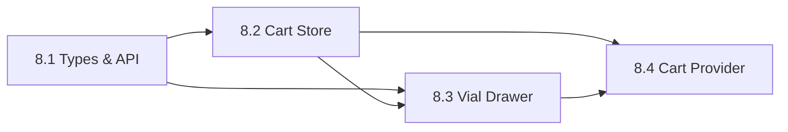

# Phase 8 Implementation Plan: Cart System Integration

**Phase Duration:** 5 days (estimated)  
**Prerequisites:** Phase 7.1 (Product Detail Page) ✅ Complete  
**Objective:** Connect frontend cart state (Zustand) to backend Cart API for full persistence, refine the Vial Drawer UI, and implement guest-to-user cart merge flow.

---

## Executive Summary

Phase 8 bridges the gap between:
- **Frontend:** Client-side Zustand `cart-store.ts` (localStorage only)
- **Backend:** Fully implemented `CartController.php` with PostgreSQL persistence

**Current State Assessment:**

| Component | Status | Gap |
|-----------|--------|-----|
| `CartController.php` | ✅ Complete (269 lines) | None |
| `CartResource.php` | ✅ Complete | None |
| `Cart.php` model | ✅ Complete | None |
| `cart-store.ts` | ⚠️ Partial | No API sync |
| `vial-drawer.tsx` | ⚠️ Partial | Uses localStorage, no API |
| `product-detail.tsx` | ⚠️ Uses setTimeout | Replace with API call |
| Cart API types | ❌ Missing | Need frontend types |

---

## Incorporating Phase 7.1 Observations

From the Phase 7.1 code review:

> ⚠️ **Observation 1:** Cart add uses `setTimeout` simulation — ready to replace with actual API in Phase 8.

> ⚠️ **Observation 2:** Consider product-specific error boundary for resilience.

These will be addressed in Sub-Phase 8.2 and 8.3.

---

## Sub-Phase 8.1: Frontend Types & API Client

**Duration:** 0.5 day  
**Objective:** Create TypeScript types matching backend CartResource and extend API client.

---

### [MODIFY] `src/types/api.ts`

**Purpose:** Add Cart-related types for API integration.

**Features:**
- `Cart` interface matching `CartResource.php` response
- `CartItem` interface matching `CartItemResource.php`
- `AddToCartRequest`, `UpdateCartItemRequest` types

**Checklist:**
- [ ] Add `Cart` interface (id, items, subtotal, discount_amount, gst_amount, total, coupon, expires_at)
- [ ] Add `CartApiItem` interface (id, variant, quantity, unit_price, line_total)
- [ ] Add `AddToCartRequest` type { variant_id: string, quantity: number }
- [ ] Add `UpdateCartItemRequest` type { quantity: number }
- [ ] Add `ApplyCouponRequest` type { code: string }

**Type Definitions:**
```typescript
export interface CartApiItem {
  id: string;
  variant: ProductVariant;
  quantity: number;
  unit_price: number;
  unit_price_formatted: string;
  line_total: number;
  line_total_formatted: string;
}

export interface Cart {
  id: string;
  items: CartApiItem[];
  items_count: number;
  subtotal: number;
  subtotal_formatted: string;
  discount_amount: number;
  discount_amount_formatted: string;
  gst_amount: number;
  gst_amount_formatted: string;
  total: number;
  total_formatted: string;
  coupon: Coupon | null;
  expires_at: string | null;
}

export interface AddToCartRequest {
  variant_id: string;
  quantity: number;
}

export interface UpdateCartItemRequest {
  quantity: number;
}

export interface ApplyCouponRequest {
  code: string;
}
```

---

### [MODIFY] `src/lib/api-client.ts`

**Purpose:** Add Cart API methods.

**Features:**
- `getCart()` — GET /cart
- `addToCart(request)` — POST /cart/items
- `updateCartItem(id, request)` — PUT /cart/items/{id}
- `removeCartItem(id)` — DELETE /cart/items/{id}
- `applyCoupon(code)` — POST /cart/coupon
- `removeCoupon()` — DELETE /cart/coupon
- Session ID header for guest carts

**Checklist:**
- [ ] Implement `getCart(): Promise<Cart>`
- [ ] Implement `addToCart(request: AddToCartRequest): Promise<Cart>`
- [ ] Implement `updateCartItem(id: string, request: UpdateCartItemRequest): Promise<Cart>`
- [ ] Implement `removeCartItem(id: string): Promise<Cart>`
- [ ] Implement `applyCoupon(code: string): Promise<Cart>`
- [ ] Implement `removeCoupon(): Promise<Cart>`
- [ ] Add `X-Session-Id` header for guest cart identification
- [ ] Generate and persist session ID in localStorage if not authenticated

---

### [NEW] `src/hooks/use-cart.ts`

**Purpose:** TanStack Query hook for cart operations with optimistic updates.

**Features:**
- `useCart()` — Fetch cart state
- `useAddToCart()` — Mutation for adding items
- `useUpdateCartItem()` — Mutation for quantity updates
- `useRemoveCartItem()` — Mutation for removal
- Optimistic updates for instant UI feedback
- Cache invalidation on mutations

**Checklist:**
- [ ] Create `useCart()` query hook with staleTime of 30 seconds
- [ ] Create `useAddToCart()` mutation with optimistic update
- [ ] Create `useUpdateCartItem()` mutation
- [ ] Create `useRemoveCartItem()` mutation
- [ ] Create `useApplyCoupon()` mutation
- [ ] Invalidate `['cart']` query key on all mutations
- [ ] Handle error states with toast notifications

---

## Sub-Phase 8.2: Cart State Management Refactor

**Duration:** 1.5 days  
**Objective:** Refactor Zustand cart-store to act as UI layer over API state.

---

### [MODIFY] `src/stores/cart-store.ts`

**Purpose:** Refactor to sync with backend API while maintaining UI responsiveness.

**Current Issues:**
- Uses only `localStorage` persistence
- No backend sync
- `addToCart` called with client-generated IDs

**New Architecture:**
```
User Action → Zustand (optimistic) → API Call → TanStack Cache → Zustand Sync
```

**Features:**
- `syncCartFromServer(cart: Cart)` — Hydrate store from API response
- `addToCartOptimistic(item)` — Optimistic local update
- `commitAddToCart(serverItem)` — Replace optimistic with server response
- `rollbackAddToCart(tempId)` — Rollback on error
- Keep localStorage for offline/guest persistence
- `cartSynced: boolean` flag for loading state

**Checklist:**
- [ ] Add `cartSynced: boolean` state
- [ ] Add `serverCartId: string | null` state
- [ ] Add `syncCartFromServer(cart: Cart)` action
- [ ] Modify `addToCart` to generate temporary client IDs
- [ ] Add `commitAddToCart(tempId, serverItem)` to replace temp items
- [ ] Add `rollbackAddToCart(tempId)` for error handling
- [ ] Preserve localStorage persistence for offline support
- [ ] Add `setCartSynced(synced: boolean)` action

---

### [MODIFY] `src/components/catalog/product-detail.tsx`

**Purpose:** Replace `setTimeout` simulation with actual API call (Phase 7.1 observation).

**Current Code (Line 34-54):**
```typescript
const handleAddToCart = () => {
  // ...
  setTimeout(() => {
    addToCart({ /* ... */ });
    // ...
  }, 600);
};
```

**New Implementation:**
```typescript
const addToCartMutation = useAddToCart();

const handleAddToCart = async () => {
  if (!selectedVariant) return;
  setIsAdding(true);
  
  try {
    await addToCartMutation.mutateAsync({
      variant_id: selectedVariant.id,
      quantity: quantity,
    });
    
    showToast(`Added ${quantity}x ${product.name}...`, 'success');
    toggleCartDrawer();
  } catch (error) {
    showToast('Failed to add to cart. Please try again.', 'error');
  } finally {
    setIsAdding(false);
  }
};
```

**Checklist:**
- [ ] Import `useAddToCart` hook
- [ ] Remove `setTimeout` simulation
- [ ] Use `mutateAsync` for async/await pattern
- [ ] Add try/catch error handling
- [ ] Show error toast on failure
- [ ] Keep loading spinner during API call

---

## Sub-Phase 8.3: Vial Drawer Refinement

**Duration:** 2 days  
**Objective:** Polish the Vial Drawer UI to match PDP quality and connect to API.

---

### [MODIFY] `src/components/cart/vial-drawer.tsx`

**Purpose:** Upgrade to "Illuminated Manuscript" aesthetic, connect to API.

**Current Issues:**
- Uses raw BEM classes from static mockup
- `formatCurrency` uses USD instead of SGD
- `handleCheckout` simulates API call
- No loading states for item operations

**New Features:**
- Use Shadcn Sheet component (library discipline)
- Apply design system tokens (Gold/Ink/Parchment)
- Show GST breakdown in footer
- Loading states for quantity changes
- Animate item removal
- Use `useCart()` hook for server state

**Checklist:**
- [ ] Replace raw `<aside>` with Shadcn `<Sheet>` component
- [ ] Apply `bg-parchment`, `border-gold`, `font-display` tokens
- [ ] Change currency format to SGD (`$` prefix, not `SGD `)
- [ ] Add GST breakdown row in footer (matching backend `gst_amount`)
- [ ] Connect to `useCart()` for items
- [ ] Use `useRemoveCartItem` mutation for removal
- [ ] Use `useUpdateCartItem` mutation for quantity changes
- [ ] Add skeleton loading state during initial fetch
- [ ] Animate item removal with Framer Motion `<AnimatePresence>`
- [ ] Add "Gold Leaf" corner ornaments to drawer (matching PDP)

**Design Updates:**
```tsx
// Header with gold border
<SheetHeader className="border-b border-gold/20 pb-4">
  <SheetTitle className="font-display text-2xl text-ink">
    Collection Vial
  </SheetTitle>
</SheetHeader>

// Footer with GST breakdown
<div className="border-t border-gold/20 pt-4 space-y-2">
  <div className="flex justify-between text-sm text-ink-light">
    <span>Subtotal</span>
    <span>{cart.subtotal_formatted}</span>
  </div>
  <div className="flex justify-between text-sm text-ink-light">
    <span>GST (9%)</span>
    <span>{cart.gst_amount_formatted}</span>
  </div>
  <div className="flex justify-between font-display text-xl text-ink">
    <span>Total</span>
    <span className="text-gold-dark">{cart.total_formatted}</span>
  </div>
</div>
```

---

### [NEW] `src/components/cart/cart-item.tsx`

**Purpose:** Extract cart item card as atomic component.

**Features:**
- Image thumbnail (from variant product)
- Product name and variant name
- Quantity controls (reuse `QuantityAdjuster` pattern)
- Remove button with confirmation
- Line total display
- Loading state during mutations

**Checklist:**
- [ ] Create atomic component with single responsibility
- [ ] Props: `item: CartApiItem`, `onQuantityChange`, `onRemove`
- [ ] Display product image thumbnail
- [ ] Show variant name (e.g., "15ml")
- [ ] Integrate quantity +/- buttons with loading state
- [ ] Add remove button with gold hover
- [ ] Show `line_total_formatted`
- [ ] Add Framer Motion exit animation

---

### [NEW] `src/components/cart/cart-loading.tsx`

**Purpose:** Skeleton loading state for cart drawer.

**Features:**
- Match cart item layout with skeletons
- Use design system shimmer effect

**Checklist:**
- [ ] Create skeleton matching cart item structure
- [ ] 3 skeleton items by default
- [ ] Use `bg-gold/10` shimmer effect

---

## Sub-Phase 8.4: Guest/Auth Cart Merge & Error Handling

**Duration:** 1 day  
**Objective:** Handle edge cases and polish the integration.

---

### [NEW] `src/components/providers/cart-provider.tsx`

**Purpose:** Context provider for cart initialization and guest/auth merge.

**Features:**
- Initialize cart on app mount
- Generate session ID for guests
- Merge guest cart to user cart on login
- Sync Zustand from server on initial load

**Checklist:**
- [ ] Create `CartProvider` component
- [ ] Generate/retrieve session ID from localStorage
- [ ] Fetch cart on mount with `useCart()`
- [ ] Call `syncCartFromServer(cart)` on initial load
- [ ] Listen to auth state changes (NextAuth)
- [ ] Call cart merge API on login (POST /cart/merge — if implemented)
- [ ] Add to root layout.tsx

---

### [NEW] `src/components/cart/cart-error-boundary.tsx`

**Purpose:** Error boundary for cart operations (Phase 7.1 observation).

**Features:**
- Catch cart-related errors
- Display friendly error message
- Retry button

**Checklist:**
- [ ] Create React error boundary component
- [ ] Display "Something went wrong with your cart"
- [ ] Add "Retry" button that reloads cart
- [ ] Log error for debugging

---

### [MODIFY] `src/app/layout.tsx`

**Purpose:** Add CartProvider to initialize cart on app load.

**Checklist:**
- [ ] Import `CartProvider`
- [ ] Wrap children with `<CartProvider>`
- [ ] Ensure VialDrawer is inside CartProvider

---

## Verification Plan

### Automated Tests

**Backend (Existing):**
```bash
cd atelier-arome-api
php artisan test --filter=CartController
```

**Frontend (New):**
```bash
cd atelier-arome-web
pnpm test src/__tests__/hooks/use-cart.test.ts
pnpm test src/__tests__/components/vial-drawer.test.tsx
```

### Manual E2E Verification

| Step | Action | Expected Result |
|------|--------|-----------------|
| 1 | Navigate to PDP `/compendium/provence-lavender` | Page loads with product |
| 2 | Select variant "15ml", quantity 2 | UI updates, price shown |
| 3 | Click "Add to Vial" | Spinner shows, cart drawer opens |
| 4 | Verify cart drawer shows item | Item with correct qty/price visible |
| 5 | Click + to increase quantity | API call, drawer updates |
| 6 | Click — to decrease quantity | API call, drawer updates |
| 7 | Click X to remove item | Item animates out, drawer updates |
| 8 | Refresh page | Cart persists from backend |
| 9 | Check GST breakdown | 9% GST calculated correctly |

### Build Verification

```bash
cd atelier-arome-web
pnpm type-check   # TypeScript validation
pnpm lint         # ESLint
pnpm build        # Production build
```

---

## File Summary

| Sub-Phase | File | Action | Priority |
|-----------|------|--------|----------|
| 8.1 | `types/api.ts` | MODIFY | High |
| 8.1 | `lib/api-client.ts` | MODIFY | High |
| 8.1 | `hooks/use-cart.ts` | NEW | High |
| 8.2 | `stores/cart-store.ts` | MODIFY | High |
| 8.2 | `components/catalog/product-detail.tsx` | MODIFY | High |
| 8.3 | `components/cart/vial-drawer.tsx` | MODIFY | High |
| 8.3 | `components/cart/cart-item.tsx` | NEW | Medium |
| 8.3 | `components/cart/cart-loading.tsx` | NEW | Low |
| 8.4 | `components/providers/cart-provider.tsx` | NEW | Medium |
| 8.4 | `components/cart/cart-error-boundary.tsx` | NEW | Low |
| 8.4 | `app/layout.tsx` | MODIFY | Medium |

**Total Files:** 11 (6 modify, 5 new)

---

## Dependencies



---

## Success Criteria

- [ ] Add to cart from PDP persists to backend
- [ ] Cart state survives page refresh
- [ ] Quantity updates sync in real-time
- [ ] GST (9%) displayed in cart drawer
- [ ] Guest carts work with session ID
- [ ] Zero console errors
- [ ] Build passes (`pnpm build`)
- [ ] Vial Drawer matches "Illuminated Manuscript" aesthetic
