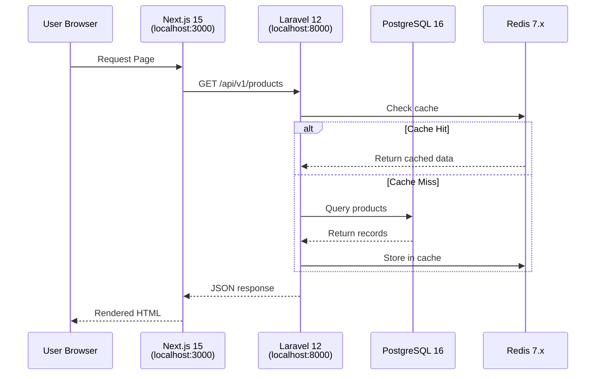
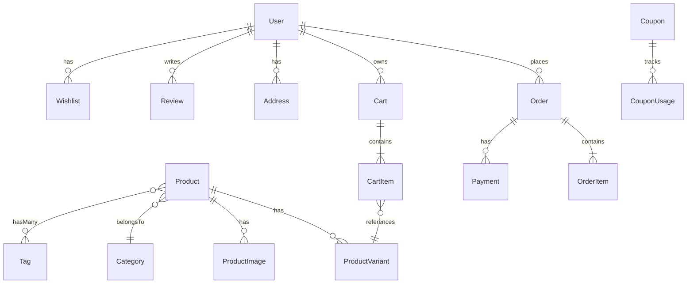

# Project Architecture Document
## Atelier Arôme — The Definitive Codebase Handbook

> **Version:** 2.0.0  
> **Last Validated:** January 9, 2026  
> **Status:** Phase 7 Complete (Product Catalog Grid) → Phase 7.1 (Product Detail Page)  
> **Purpose:** Single source-of-truth for developers and AI coding agents

---

## Table of Contents

1. [Executive Summary](#1-executive-summary)
2. [Architecture Overview](#2-architecture-overview)
3. [Technology Stack](#3-technology-stack)
4. [Repository Structure](#4-repository-structure)
5. [Backend Architecture (Laravel 12)](#5-backend-architecture-laravel-12)
6. [Frontend Architecture (Next.js 15)](#6-frontend-architecture-nextjs-15)
7. [Database Schema](#7-database-schema)
8. [API Reference](#8-api-reference)
9. [Design System: Illuminated Manuscript](#9-design-system-illuminated-manuscript)
10. [State Management](#10-state-management)
11. [Development Workflow](#11-development-workflow)
12. [Testing Strategy](#12-testing-strategy)
13. [Infrastructure & Deployment](#13-infrastructure--deployment)
14. [Security Considerations](#14-security-considerations)
15. [Common Pitfalls & Solutions](#15-common-pitfalls--solutions)
16. [Phase Status & Roadmap](#16-phase-status--roadmap)
17. [Quick Reference](#17-quick-reference)

---

## 1. Executive Summary

### What is Atelier Arôme?

**Atelier Arôme** is a production-grade **headless e-commerce platform** for a Singapore-based artisanal aromatherapy company. The platform features a distinctive **"Illuminated Manuscript"** Renaissance-inspired aesthetic that deliberately rejects generic e-commerce templates.

### Key Differentiators

| Aspect | Atelier Arôme Approach |
|--------|------------------------|
| **Aesthetic** | Renaissance "Illuminated Manuscript" theme, NOT modern minimalism |
| **Typography** | Cormorant Garamond, Crimson Pro, Great Vibes (NOT Inter/Roboto) |
| **Colors** | Ink (#2A2D26), Gold (#C9A769), Parchment (#FAF8F5) |
| **Localization** | Singapore-first: GST (9%), PayNow, SingPost, SGD currency |
| **Architecture** | Headless commerce: Laravel 12 API + Next.js 15 Frontend |

### Core Philosophy: Anti-Generic

We deliberately reject:
- ❌ Inter/Roboto/system font "safety"
- ❌ Purple-gradient-on-white clichés
- ❌ Predictable card grids and hero sections
- ❌ Homogenized "AI slop" aesthetics

We embrace:
- ✅ Renaissance-inspired visual language
- ✅ Custom Tailwind theme with serif typography
- ✅ Alchemical and botanical themes
- ✅ WCAG AAA accessibility standards

---

## 2. Architecture Overview

### High-Level System Diagram

```
┌─────────────────────────────────────────────────────────────┐
│                     HEADLESS COMMERCE                        │
├─────────────────────────────────────────────────────────────┤
│                                                               │
│  ┌──────────────────┐              ┌──────────────────┐     │
│  │  Next.js 15      │◄────JSON────►│  Laravel 12 API  │     │
│  │  (Vercel Edge)   │              │  (Forge/Vapor)   │     │
│  │  localhost:3000  │              │  localhost:8000  │     │
│  └──────────────────┘              └──────────────────┘     │
│         │                                   │                │
│         │                                   ▼                │
│         │                          ┌──────────────────┐     │
│         │                          │  PostgreSQL 16   │     │
│         │                          │  Redis 7.x       │     │
│         │                          │  Meilisearch     │     │
│         │                          └──────────────────┘     │
│         │                                                    │
│         ▼                                                    │
│  ┌──────────────────┐                                       │
│  │  Stripe + PayNow │                                       │
│  │  Cloudinary CDN  │                                       │
│  │  SingPost API    │                                       │
│  └──────────────────┘                                       │
│                                                               │
└─────────────────────────────────────────────────────────────┘
```

### Data Flow



---

## 3. Technology Stack

### Backend Stack

| Component | Technology | Version | Purpose |
|-----------|------------|---------|---------|
| **Framework** | Laravel | 12.x | PHP API framework |
| **Language** | PHP | 8.2+ | Server-side logic |
| **Database** | PostgreSQL | 16 | Primary data store |
| **Cache** | Redis | 7.x | Cache, sessions, queues |
| **Auth** | Laravel Sanctum | 4.2 | API token authentication |
| **Admin** | Filament | 3.x (planned) | Admin panel |
| **Queue** | Laravel Horizon | 5.x (planned) | Queue management |
| **Search** | Meilisearch | 1.x (planned) | Full-text search |

### Frontend Stack

| Component | Technology | Version | Purpose |
|-----------|------------|---------|---------|
| **Framework** | Next.js | 15.5.9 | React framework with App Router |
| **UI Library** | React | 19.2.3 | Component library |
| **Language** | TypeScript | 5.9.3 | Type safety |
| **Styling** | Tailwind CSS | 4.1.18 | Utility-first CSS |
| **Components** | Shadcn-UI + Radix | Latest | UI primitives |
| **State (Client)** | Zustand | 5.0.9 | Client-side state |
| **State (Server)** | TanStack Query | 5.90.16 | Server state management |
| **Forms** | React Hook Form + Zod | 7.70 / 4.3.5 | Form validation |
| **Animations** | Framer Motion | 12.23.26 | Motion library |
| **HTTP** | Axios | 1.13.2 | API client |

### Infrastructure

| Component | Technology | Purpose |
|-----------|------------|---------|
| **Containers** | Docker Compose | Local development |
| **Database** | atelier_db (Docker) | PostgreSQL container |
| **Cache** | atelier_redis (Docker) | Redis container |
| **Email** | atelier_mailhog (Docker) | Email testing |

---

## 4. Repository Structure

### Root Directory

```
atelier-arome/                          # Monorepo root
├── atelier-arome-api/                  # Laravel 12 Backend (137 files)
├── atelier-arome-web/                  # Next.js 15 Frontend (59 files)
├── docker/                             # Docker configuration
│   └── docker-compose.yml
├── docs/                               # Documentation (27 files)
│   ├── Comprehensive_Project_Understanding.md
│   └── architecture_decision.md
├── AGENT.md                            # Agent guidance (1360 lines)
├── CLAUDE.md                           # Claude-specific guidance (1392 lines)
├── GEMINI.md                           # Gemini-specific guidance (109 lines)
├── README.md                           # Project README (1186 lines)
├── MASTER_EXECUTION_PLAN.md            # 16-phase plan (2263 lines)
├── index.html                          # Static mockup reference
├── styles.css                          # Design system reference
├── main.js                             # JavaScript reference
└── docker-compose.yml                  # Root Docker compose
```

### Backend Structure (`atelier-arome-api/`)

```
atelier-arome-api/
├── app/
│   ├── Http/
│   │   ├── Controllers/
│   │   │   ├── Api/
│   │   │   │   └── V1/                 # 12 API Controllers ✅
│   │   │   │       ├── AddressController.php
│   │   │   │       ├── AuthController.php
│   │   │   │       ├── CartController.php
│   │   │   │       ├── CategoryController.php
│   │   │   │       ├── CheckoutController.php
│   │   │   │       ├── NewsletterController.php
│   │   │   │       ├── OrderController.php
│   │   │   │       ├── ProductController.php
│   │   │   │       ├── ReviewController.php
│   │   │   │       ├── TagController.php
│   │   │   │       ├── TestimonialController.php
│   │   │   │       └── WishlistController.php
│   │   │   └── Controller.php
│   │   ├── Middleware/
│   │   └── Resources/                  # 14 API Resources ✅
│   │       ├── AddressResource.php
│   │       ├── CartItemResource.php
│   │       ├── CartResource.php
│   │       ├── CategoryResource.php
│   │       ├── CouponResource.php
│   │       ├── OrderItemResource.php
│   │       ├── OrderResource.php
│   │       ├── ProductImageResource.php
│   │       ├── ProductResource.php
│   │       ├── ProductVariantResource.php
│   │       ├── ReviewResource.php
│   │       ├── TagResource.php
│   │       ├── TestimonialResource.php
│   │       └── UserResource.php
│   ├── Models/                         # 22 Eloquent Models ✅
│   │   ├── Address.php
│   │   ├── Cart.php
│   │   ├── CartItem.php
│   │   ├── Category.php
│   │   ├── Coupon.php
│   │   ├── CouponUsage.php
│   │   ├── Inventory.php
│   │   ├── InventoryMovement.php
│   │   ├── NewsletterSubscriber.php
│   │   ├── Order.php
│   │   ├── OrderItem.php
│   │   ├── Payment.php
│   │   ├── Product.php
│   │   ├── ProductImage.php
│   │   ├── ProductVariant.php
│   │   ├── Review.php
│   │   ├── Setting.php
│   │   ├── Tag.php
│   │   ├── Testimonial.php
│   │   ├── User.php
│   │   ├── Wishlist.php
│   │   └── WishlistItem.php
│   └── Providers/
├── config/                             # 11 config files
├── database/
│   ├── migrations/                     # 26 migrations ✅
│   └── seeders/                        # 7 seeders ✅
│       ├── CategorySeeder.php
│       ├── DatabaseSeeder.php
│       ├── ProductSeeder.php
│       ├── SettingsSeeder.php
│       ├── TagSeeder.php
│       ├── TestimonialSeeder.php
│       └── UserSeeder.php
├── routes/
│   ├── api.php                         # 144 lines, full V1 API ✅
│   ├── console.php
│   └── web.php
├── tests/
├── .env                                # Environment config
└── composer.json                       # PHP dependencies
```

### Frontend Structure (`atelier-arome-web/`)

```
atelier-arome-web/
├── src/
│   ├── app/                            # Next.js App Router ✅
│   │   ├── (account)/                  # Account route group
│   │   ├── (checkout)/                 # Checkout route group
│   │   ├── (marketing)/                # Marketing route group
│   │   ├── (shop)/                     # Shop route group
│   │   │   ├── compendium/
│   │   │   │   └── page.tsx            # Product catalog page
│   │   │   └── layout.tsx
│   │   ├── atelier.css                 # BEM styles (84KB)
│   │   ├── globals.css                 # Global styles
│   │   ├── layout.tsx                  # Root layout
│   │   ├── loading.tsx                 # Loading skeleton
│   │   ├── error.tsx                   # Error boundary
│   │   └── page.tsx                    # Homepage
│   ├── components/
│   │   ├── cart/
│   │   │   └── vial-drawer.tsx         # Cart drawer ✅
│   │   ├── catalog/                    # Product catalog ✅
│   │   │   ├── filter-sidebar.tsx
│   │   │   ├── product-card.tsx
│   │   │   └── product-grid.tsx
│   │   ├── hero/                       # Atomic hero components ✅
│   │   │   ├── alchemical-vessel.tsx
│   │   │   ├── botanical-layer.tsx
│   │   │   ├── hero-frame.tsx
│   │   │   └── hero-section.tsx
│   │   ├── layout/
│   │   │   ├── header.tsx
│   │   │   └── footer.tsx
│   │   ├── sections/                   # Page sections ✅
│   │   │   ├── alchemy-section.tsx
│   │   │   ├── compendium-section.tsx
│   │   │   ├── newsletter-section.tsx
│   │   │   └── testimonials-section.tsx
│   │   └── ui/                         # Shadcn UI primitives ✅
│   │       ├── animate-in-view.tsx
│   │       ├── button.tsx
│   │       ├── sheet.tsx
│   │       ├── skeleton.tsx
│   │       └── toast.tsx
│   ├── hooks/                          # Custom React hooks ✅
│   │   ├── index.ts                    # Barrel export
│   │   ├── use-intersection.ts
│   │   ├── use-products.ts             # TanStack Query hook
│   │   ├── use-reduced-motion.ts
│   │   └── use-scroll.ts
│   ├── lib/                            # Utilities ✅
│   │   ├── a11y.ts                     # Accessibility helpers
│   │   ├── api-client.ts               # Axios API client
│   │   └── utils.ts                    # cn() class merger
│   ├── stores/                         # Zustand stores ✅
│   │   ├── cart-store.ts
│   │   └── toast-store.ts
│   └── types/
│       └── api.ts                      # TypeScript API types
├── public/
├── tailwind.config.ts                  # Custom theme (156 lines) ✅
├── next.config.ts
├── tsconfig.json
└── package.json                        # Node dependencies
```

---

## 5. Backend Architecture (Laravel 12)

### Models (22 Total)

All models use **UUID primary keys** via `HasUuids` trait.

| Model | Table | Key Features |
|-------|-------|--------------|
| `User` | users | Roles (customer/admin/superadmin), soft deletes |
| `Product` | products | Alchemical properties (humour/rarity/season), soft deletes |
| `ProductVariant` | product_variants | 5ml/15ml/30ml sizes, SKU, price_sgd |
| `ProductImage` | product_images | Multiple images, is_primary, sort_order |
| `Category` | categories | Singles/Blends/Sets/Gifts |
| `Tag` | tags | Scent note tags |
| `Order` | orders | Order number AA-YYYYMMDD-XXXX, GST calculation |
| `OrderItem` | order_items | **Snapshot pattern** (stores product data at purchase) |
| `Cart` | carts | Guest/authenticated support, expires_at |
| `CartItem` | cart_items | Variant FK, quantity, unit_price snapshot |
| `Payment` | payments | Stripe payment_intent_id, method enum |
| `Address` | addresses | Shipping/billing, Singapore postal codes |
| `Coupon` | coupons | Percentage/fixed/free_shipping types |
| `CouponUsage` | coupon_usages | Redemption tracking |
| `Review` | reviews | 1-5 rating, verified purchase flag |
| `Testimonial` | testimonials | is_illuminated for featured styling |
| `Wishlist` | wishlists | User wishlist |
| `WishlistItem` | wishlist_items | Product in wishlist |
| `Inventory` | inventories | Stock per variant |
| `InventoryMovement` | inventory_movements | Stock audit log |
| `NewsletterSubscriber` | newsletter_subscribers | Double opt-in |
| `Setting` | settings | Key-value store |

### Critical Model Relationships

```php
// User → Orders (one-to-many)
$user->orders()->get();

// Product → Variants (one-to-many)
$product->variants()->get();
$product->defaultVariant(); // Helper method

// Product → Images (one-to-many, ordered)
$product->images()->orderBy('sort_order')->get();
$product->primaryImage(); // Helper method

// Product → Tags (many-to-many)
$product->tags()->attach($tagIds);

// Cart → CartItems (one-to-many, with eager loading)
$cart->items()->with('variant.product')->get();

// Order → OrderItems (snapshot data)
$order->items; // Uses snapshot, not live product data
```

### Controllers (12 API Controllers)

All controllers are namespaced under `App\Http\Controllers\Api\V1\`:

| Controller | Endpoints | Auth Required |
|------------|-----------|---------------|
| `ProductController` | Products list, detail, featured | No |
| `CategoryController` | Categories list, detail | No |
| `TagController` | Tags list | No |
| `TestimonialController` | Testimonials list | No |
| `CartController` | Cart CRUD, coupon apply | No (session-based) |
| `AuthController` | Login, register, logout, profile | Partial |
| `AddressController` | Address CRUD | Yes |
| `OrderController` | Order list, detail | Yes |
| `WishlistController` | Wishlist CRUD | Yes |
| `ReviewController` | Review CRUD | Yes |
| `CheckoutController` | Initiate, complete checkout | Yes |
| `NewsletterController` | Subscribe, confirm, unsubscribe | No |

### API Resources (14 JSON Transformers)

Resources transform Eloquent models to JSON API responses:

- `ProductResource`, `ProductVariantResource`, `ProductImageResource`
- `CategoryResource`, `TagResource`
- `CartResource`, `CartItemResource`
- `OrderResource`, `OrderItemResource`
- `UserResource`, `AddressResource`
- `ReviewResource`, `TestimonialResource`, `CouponResource`

---

## 6. Frontend Architecture (Next.js 15)

### App Router Structure

```
src/app/
├── (account)/          # Protected account pages
├── (checkout)/         # Checkout flow
├── (marketing)/        # About, Alchemy, Contact
├── (shop)/             # Product catalog
│   └── compendium/     # /compendium route
└── layout.tsx          # Root layout with fonts, providers
```

### Component Architecture (Atomic Design)

```
┌─────────────────────────────────────────────────────────┐
│  ORCHESTRATORS (Compose multiple atoms)                 │
│  • hero-section.tsx (imports frame, vessel, botanical)  │
│  • header.tsx (navigation + cart integration)           │
│  • compendium page (grid + sidebar + cards)             │
└─────────────────────────────────────────────────────────┘
                          │
                          ▼
┌─────────────────────────────────────────────────────────┐
│  ATOMIC COMPONENTS (Single responsibility, ~60-150 LOC) │
│  • hero-frame.tsx (layout + border ornaments)           │
│  • alchemical-vessel.tsx (SVG + CSS animations)         │
│  • botanical-layer.tsx (parallax elements)              │
│  • product-card.tsx (single product display)            │
│  • filter-sidebar.tsx (filtering controls)              │
└─────────────────────────────────────────────────────────┘
                          │
                          ▼
┌─────────────────────────────────────────────────────────┐
│  UI PRIMITIVES (Shadcn-UI + Radix)                      │
│  • sheet.tsx (dialog drawer)                            │
│  • button.tsx (styled button)                           │
│  • toast.tsx (notifications)                            │
│  • skeleton.tsx (loading placeholder)                   │
└─────────────────────────────────────────────────────────┘
```

### Custom Hooks (5 Hooks)

| Hook | Purpose | Pattern |
|------|---------|---------|
| `useScroll` | Scroll position + smooth scroll | useSyncExternalStore |
| `useIntersection` | IntersectionObserver wrapper | useRef + useEffect |
| `useReducedMotion` | Respects prefers-reduced-motion | useSyncExternalStore |
| `useProducts` | Fetch products with TanStack Query | useQuery |
| (Barrel export) | `index.ts` exports all hooks | - |

### Stores (Zustand - 2 Stores)

```typescript
// cart-store.ts
export const useCartStore = create<CartState>()(
  persist(
    (set) => ({
      items: [],
      cartDrawerOpen: false,
      addToCart: (item) => { /* ... */ },
      removeFromCart: (id) => { /* ... */ },
      updateQuantity: (id, qty) => { /* ... */ },
      clearCart: () => { /* ... */ },
      toggleCartDrawer: () => { /* ... */ },
    }),
    { name: 'atelier-arome-cart' } // localStorage key
  )
);

// toast-store.ts
export const useToastStore = create<ToastState>((set) => ({
  toasts: [],
  addToast: (toast) => { /* ... */ },
  removeToast: (id) => { /* ... */ },
}));
```

---

## 7. Database Schema

### Schema Overview

**Total Tables:** 26 (via 26 migrations)



### Table Categories

| Category | Tables | Count |
|----------|--------|-------|
| **Core Auth** | users, password_reset_tokens, sessions, personal_access_tokens | 4 |
| **Products** | categories, products, product_variants, product_images, tags, product_tag, inventories, inventory_movements | 8 |
| **Shopping** | carts, cart_items | 2 |
| **Orders** | orders, order_items, payments, addresses, coupons, coupon_usages | 6 |
| **User Data** | reviews, testimonials, wishlists, wishlist_items, newsletter_subscribers | 5 |
| **System** | settings | 1 |

### Critical Design Patterns

#### 1. UUID Primary Keys

```php
// All tables use UUID, not auto-increment
$table->uuid('id')->primary();

// Why: Security (prevents enumeration), distributed generation
```

#### 2. Soft Deletes

```php
// Applied to: users, products, orders, addresses
$table->softDeletes();

// Why: Data retention, order history integrity
```

#### 3. Snapshot Pattern (Order Items)

```php
// order_items stores product data at purchase time
$table->string('product_name');    // NOT FK to products.name
$table->string('variant_name');    // Snapshot
$table->string('sku');             // Snapshot
$table->decimal('unit_price', 10, 2); // Snapshot

// Why: Product edits don't corrupt historical orders
```

#### 4. Alchemical Properties

```php
// Products have thematic categorization
$table->enum('humour', ['calming', 'uplifting', 'grounding', 'clarifying']);
$table->enum('rarity', ['common', 'rare', 'limited']);
$table->enum('season', ['spring', 'summer', 'autumn', 'winter']);
```

### Seeded Data

| Entity | Count | Examples |
|--------|-------|----------|
| Users | 5 | superadmin@atelierarome.sg, admin@atelierarome.sg |
| Categories | 4 | Singles, Blends, Sets, Gifts |
| Tags | 27 | Lavender, Bergamot, Calming, Uplifting |
| Products | 5 | Lavender Essential Oil, Peace & Harmony Blend |
| Variants | 13 | 5ml, 15ml, 30ml per product |
| Testimonials | 5 | Featured patron reviews |
| Settings | 7 | GST rate, currency, store info |

---

## 8. API Reference

### Base URL

```
Development: http://localhost:8000/api/v1
```

### Authentication

```http
# Register
POST /auth/register
Content-Type: application/json
{ "name": "...", "email": "...", "password": "..." }

# Login
POST /auth/login
Content-Type: application/json
{ "email": "...", "password": "..." }
→ Returns: { "token": "...", "user": {...} }

# Get Current User (Protected)
GET /user
Authorization: Bearer {token}

# Logout (Protected)
POST /user/logout
Authorization: Bearer {token}
```

### Products (Public)

```http
# List Products (paginated, filterable)
GET /products
GET /products?humour=calming
GET /products?rarity=rare
GET /products?category=singles
GET /products?featured=true
GET /products?search=lavender
GET /products?page=2&per_page=12

# Featured Products
GET /products/featured

# Single Product
GET /products/{slug}
```

### Categories & Tags (Public)

```http
# List Categories
GET /categories

# Category Detail
GET /categories/{slug}

# List Tags
GET /tags
```

### Cart (Session-based)

```http
# Get Cart
GET /cart

# Add Item
POST /cart/items
{ "variant_id": "uuid", "quantity": 1 }

# Update Quantity
PUT /cart/items/{id}
{ "quantity": 2 }

# Remove Item
DELETE /cart/items/{id}

# Apply Coupon
POST /cart/coupon
{ "code": "SAVE10" }

# Remove Coupon
DELETE /cart/coupon
```

### Orders (Protected)

```http
# List User Orders
GET /orders
Authorization: Bearer {token}

# Order Detail
GET /orders/{orderNumber}
Authorization: Bearer {token}
```

### Checkout (Protected)

```http
# Initiate Checkout
POST /checkout/initiate
Authorization: Bearer {token}

# Complete Checkout
POST /checkout/complete
Authorization: Bearer {token}
{ "payment_intent_id": "...", "address_id": "..." }
```

### Response Format

```json
{
  "data": { /* Resource or collection */ },
  "meta": {
    "current_page": 1,
    "per_page": 12,
    "total": 147
  },
  "links": {
    "self": "/api/v1/products?page=1",
    "next": "/api/v1/products?page=2"
  }
}
```

---

## 9. Design System: Illuminated Manuscript

### Color Palette

```typescript
// tailwind.config.ts - Custom Colors
colors: {
  // Primary Palette
  ink: {
    DEFAULT: '#2A2D26',     // Deep charcoal (text)
    light: '#4A4D46',       // Lighter ink
    muted: '#545752',       // Accessible muted text
  },
  gold: {
    DEFAULT: '#C9A769',     // Byzantine gold (accents)
    light: '#E8D8B6',       // Light gold
    dark: '#A98750',        // Dark gold
    muted: 'rgba(201, 167, 105, 0.3)', // Subtle gold
    text: '#8B7355',        // WCAG AA compliant gold
  },
  parchment: {
    DEFAULT: '#FAF8F5',     // Warm off-white (background)
    dark: '#F5F1EB',        // Darker parchment
    darker: '#E8E4D9',      // Even darker
  },
  
  // Botanical Accents
  lavender: '#B8A9C9',      // Calming
  eucalyptus: '#7CB9A0',    // Clarifying
  bergamot: '#F5D489',      // Uplifting
  rosehip: '#E8B4B8',       // Rare
  
  // Supporting Colors
  bronze: '#9A8C6D',
  rose: '#B87D7D',
  sage: '#7C6354',
  slate: '#7A8C9D',
}
```

### Typography

```typescript
// tailwind.config.ts - Font Families
fontFamily: {
  display: ['var(--font-display)', 'Cormorant Garamond', 'Georgia', 'serif'],
  body: ['var(--font-body)', 'Crimson Pro', 'Georgia', 'serif'],
  accent: ['var(--font-accent)', 'Great Vibes', 'cursive'],
  ornament: ['Playfair Display', 'serif'],
}

// Fluid Typography (clamp-based)
fontSize: {
  xs: ['clamp(0.75rem, 0.7rem + 0.25vw, 0.875rem)', { lineHeight: '1.5' }],
  base: ['clamp(1rem, 0.95rem + 0.25vw, 1.125rem)', { lineHeight: '1.6' }],
  '3xl': ['clamp(2rem, 1.8rem + 2.5vw, 3rem)', { lineHeight: '0.9' }],
  // ...
}
```

### Animation System

```typescript
// tailwind.config.ts - Keyframes & Animations
keyframes: {
  'liquid-wave': {
    '0%, 100%': { transform: 'translateY(0) scaleY(1)' },
    '50%': { transform: 'translateY(-10px) scaleY(1.05)' },
  },
  'float-botanical': {
    '0%, 100%': { transform: 'translateY(0) rotate(0deg)' },
    '50%': { transform: 'translateY(-20px) rotate(5deg)' },
  },
  'seal-rotate': {
    from: { transform: 'rotate(0deg)' },
    to: { transform: 'rotate(360deg)' },
  },
  'bubble-rise': {
    '0%': { transform: 'translateY(0)', opacity: '1' },
    '100%': { transform: 'translateY(-40px)', opacity: '0' },
  },
},
animation: {
  'seal-rotate': 'seal-rotate 30s linear infinite',
  'liquid-sway': 'liquid-sway 3s ease-in-out infinite',
  'bubble-rise': 'bubble-rise 2s ease-out infinite',
  'float': 'float 6s ease-in-out infinite',
}
```

### Accessibility Requirements

```css
/* globals.css - Reduced Motion Support (CRITICAL) */
@media (prefers-reduced-motion: reduce) {
  *, *::before, *::after {
    animation-duration: 0.01ms !important;
    transition-duration: 0.01ms !important;
    scroll-behavior: auto !important;
  }
}
```

**WCAG Compliance:**
- Color contrast: AA minimum, AAA target
- Focus states: 3px gold outline + 4px offset
- ARIA live regions for cart updates, errors
- Keyboard navigation support
- Screen reader announcements via `a11y.ts`

---

## 10. State Management

### Client State (Zustand)

Used for UI-only state that doesn't need server sync:

```typescript
// Cart drawer open/close
const { cartDrawerOpen, toggleCartDrawer } = useCartStore();

// Toast notifications
const { addToast } = useToastStore();
```

### Server State (TanStack Query)

Used for data that originates from the API:

```typescript
// Fetching products with caching
const { data: products, isLoading, error } = useProducts({
  category: 'singles',
  humour: 'calming',
  page: 1,
});

// Query configuration
const queryClient = new QueryClient({
  defaultOptions: {
    queries: {
      staleTime: 5 * 60 * 1000, // 5 minutes
      gcTime: 10 * 60 * 1000,   // 10 minutes (was cacheTime)
    },
  },
});
```

### Why NOT Redux?

| Library | Bundle Size | Learning Curve |
|---------|-------------|----------------|
| Zustand | 1.2KB | Simple |
| TanStack Query | 12KB | Moderate |
| Redux Toolkit | 45KB | Complex |

Zustand + TanStack Query provides better separation of concerns with smaller bundle.

---

## 11. Development Workflow

### Prerequisites

**Backend:**
- PHP 8.3+
- Composer 2.x
- PostgreSQL 16 (Docker recommended)
- Redis 7.x (Docker recommended)

**Frontend:**
- Node.js 20+
- pnpm 8+ (preferred) or npm 10+

### Quick Start with Docker

```bash
# 1. Start Docker services
docker-compose up -d

# 2. Setup Backend
cd atelier-arome-api
composer install
cp .env.example .env
php artisan key:generate
php artisan migrate
php artisan db:seed
php artisan serve

# 3. Setup Frontend (new terminal)
cd atelier-arome-web
pnpm install
cp .env.local.example .env.local
pnpm dev

# 4. Access
# Frontend: http://localhost:3000
# Backend:  http://localhost:8000
# Mailhog:  http://localhost:8025
```

### Common Commands

**Backend:**
```bash
php artisan serve          # Start dev server
php artisan test           # Run tests
php artisan migrate:fresh --seed  # Reset DB
./vendor/bin/pint          # Code formatting
```

**Frontend:**
```bash
pnpm dev                   # Start dev server
pnpm build                 # Production build
pnpm lint                  # ESLint
pnpm type-check            # TypeScript check
```

### Component Creation Workflow ("Construct and Conquer")

1. **NEVER patch broken code** - Create new, clean component
2. Build atomic component first (~60-150 lines)
3. Test in isolation
4. Compose into orchestrator
5. Run `pnpm build` to verify

```bash
# Example: Creating a new component
mkdir -p src/components/catalog
touch src/components/catalog/product-card.tsx

# Write clean component, then:
pnpm type-check && pnpm build
```

---

## 12. Testing Strategy

### Backend Testing (PHPUnit/Pest)

```bash
php artisan test                          # All tests
php artisan test --testsuite=Feature      # Integration
php artisan test --testsuite=Unit         # Unit
php artisan test --coverage               # With coverage
```

**Test Structure:**
```
tests/
├── Feature/
│   └── Api/
│       ├── AuthTest.php
│       ├── ProductTest.php
│       └── CartTest.php
└── Unit/
    ├── Services/
    └── Models/
```

### Frontend Testing (Vitest + Playwright)

```bash
pnpm test              # Unit tests (Vitest)
pnpm test:watch        # Watch mode
pnpm test:e2e          # E2E tests (Playwright)
```

**Test Structure:**
```
src/
├── __tests__/
│   ├── components/
│   └── utils/
└── e2e/
    ├── checkout.spec.ts
    └── product-browsing.spec.ts
```

---

## 13. Infrastructure & Deployment

### Local Development (Docker)

| Container | Image | Port | Purpose |
|-----------|-------|------|---------|
| atelier_db | postgres:16-alpine | 5432 | PostgreSQL |
| atelier_redis | redis:7.4-alpine | 6379 | Redis |
| atelier_mailhog | mailhog/mailhog | 1025/8025 | Email testing |

### Production Architecture

| Layer | Service | Purpose |
|-------|---------|---------|
| Frontend | Vercel (Edge) | Next.js hosting, ISR |
| Backend | Laravel Forge/Vapor | Laravel hosting |
| Database | Neon | Managed PostgreSQL |
| Cache | Upstash | Managed Redis |
| CDN | Cloudflare | Static assets |
| Payments | Stripe | Payment processing |
| Monitoring | Sentry | Error tracking |

### Environment Stages

| Environment | Frontend | Backend | Database |
|-------------|----------|---------|----------|
| Development | localhost:3000 | localhost:8000 | Docker (atelier_db) |
| Staging | staging.atelierarome.com | api-staging.atelierarome.com | Neon staging |
| Production | atelierarome.com | api.atelierarome.com | Neon production |

---

## 14. Security Considerations

### OWASP Top 10 Mitigations

| Threat | Mitigation |
|--------|------------|
| SQL Injection | Eloquent ORM, parameterized queries |
| XSS | React auto-escaping, Blade `{{ }}` |
| CSRF | Laravel CSRF tokens, SameSite cookies |
| Broken Auth | Sanctum tokens, bcrypt hashing |
| Broken Access | Laravel policies, role-based access |

### Rate Limiting

```php
// 60 requests per minute per IP
Route::middleware(['throttle:60,1'])->group(function () {
    // ...
});
```

### Payment Security

- **NEVER** store credit card numbers or CVV
- Use Stripe Elements for client-side tokenization
- Verify Stripe webhook signatures
- PCI compliance offloaded to Stripe

---

## 15. Common Pitfalls & Solutions

### 1. JSX Syntax Errors

**Problem:** Unclosed tags or template literals in JSX
```
Error: x Expression expected
```

**Solution:** "Construct and Conquer"
- Don't debug line-by-line
- Create new clean component
- Overwrite broken file

### 2. N+1 Query Problems

**Problem:** Loading products without relationships
```php
// ❌ N+1 queries
$products = Product::all();
foreach ($products as $product) {
    echo $product->category->name; // +1 query!
}
```

**Solution:** Eager loading
```php
// ✅ Single query
$products = Product::with(['category', 'variants', 'images'])->get();
```

### 3. CORS Issues

**Problem:** Frontend can't connect to API

**Solution:** Configure `config/cors.php`:
```php
'paths' => ['api/*', 'sanctum/csrf-cookie'],
'allowed_origins' => [env('FRONTEND_URL', 'http://localhost:3000')],
'supports_credentials' => true,
```

### 4. Cart Overselling

**Problem:** Multiple users buying last item

**Solution:** Pessimistic locking:
```php
DB::transaction(function () {
    $inventory = Inventory::where('variant_id', $id)
        ->lockForUpdate()  // Pessimistic lock
        ->first();
    // Check and decrement
});
```

---

## 16. Phase Status & Roadmap

### Current Status

| Phase | Status | Description |
|-------|--------|-------------|
| **1. Foundation** | ✅ Complete | Project setup, database, Docker |
| **2. Backend Core** | ✅ Complete | Models, Controllers, Resources, Routes |
| **3. Frontend Foundation** | ✅ Complete | Next.js setup, atomic components |
| **4. Design System** | ✅ Complete | Tailwind theme, Shadcn-UI |
| **5. Authentication** | ✅ Complete | Sanctum integration |
| **6. Product Mgmt (BE)** | ✅ Complete | Product API endpoints |
| **7. Product Catalog (FE)** | ✅ Complete | Grid, Cards, Filters, URL sync |
| **8. Cart System** | 🚧 Pending | Cart backend + frontend integration |
| **9. Checkout Flow** | 🚧 Pending | Multi-step checkout |
| **10-16** | 📋 Planned | Payment, Orders, Admin, Search, Launch |

### Next Immediate Actions

1. **Product Detail Page** (`/compendium/[slug]`) - Show full product details
2. **Cart Integration** - Verify "Add to Vial" works with API
3. **Real Images** - Verify images load from API

### See Also

- `MASTER_EXECUTION_PLAN.md` - Full 16-phase breakdown (2263 lines)
- `Updated_Project_Understanding.md` - Deep project analysis

---

## 17. Quick Reference

### File Locations

| What | Where |
|------|-------|
| API Controllers | `atelier-arome-api/app/Http/Controllers/Api/V1/` |
| Eloquent Models | `atelier-arome-api/app/Models/` |
| API Routes | `atelier-arome-api/routes/api.php` |
| Migrations | `atelier-arome-api/database/migrations/` |
| React Components | `atelier-arome-web/src/components/` |
| Custom Hooks | `atelier-arome-web/src/hooks/` |
| Zustand Stores | `atelier-arome-web/src/stores/` |
| Tailwind Config | `atelier-arome-web/tailwind.config.ts` |
| App Router | `atelier-arome-web/src/app/` |

### Key Commands

```bash
# Backend
cd atelier-arome-api
php artisan serve              # Start server
php artisan migrate:fresh --seed  # Reset DB
php artisan test               # Run tests

# Frontend
cd atelier-arome-web
pnpm dev                       # Start server
pnpm build                     # Build check
pnpm type-check                # TypeScript check

# Docker
docker-compose up -d           # Start containers
docker exec -it atelier_db psql -U postgres -d atelier_arome_dev
```

### Design Tokens (Quick Copy)

```css
/* Colors */
--ink: #2A2D26;
--gold: #C9A769;
--parchment: #FAF8F5;

/* Fonts */
--font-display: 'Cormorant Garamond';
--font-body: 'Crimson Pro';
--font-accent: 'Great Vibes';
```

### Environment Variables

**Backend (`.env`):**
```env
DB_CONNECTION=pgsql
DB_DATABASE=atelier_arome_dev
REDIS_HOST=127.0.0.1
```

**Frontend (`.env.local`):**
```env
NEXT_PUBLIC_API_URL=http://localhost:8000/api/v1
NEXTAUTH_SECRET=<generate-with-openssl>
```

---

## Document History

| Version | Date | Author | Changes |
|---------|------|--------|---------|
| 2.0.0 | 2026-01-09 | AI Agent | Complete rewrite with validated codebase status |
| 1.0.0 | 2026-01-05 | AI Agent | Initial document |

---

**This document is the single source of truth. When in doubt, consult this document first.**
