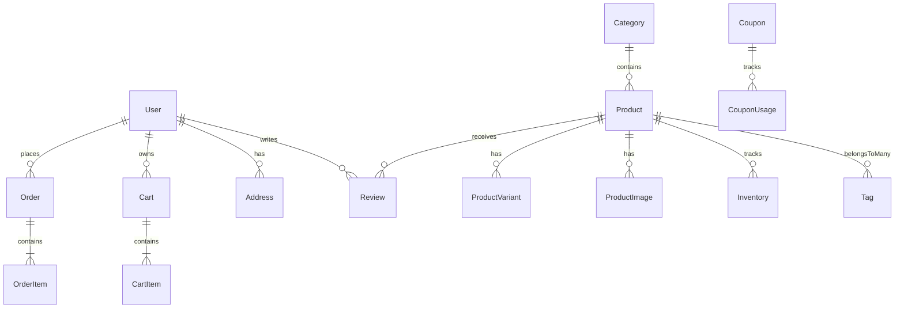
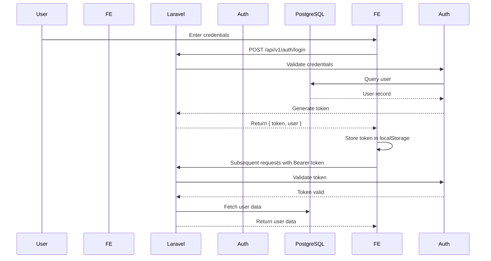
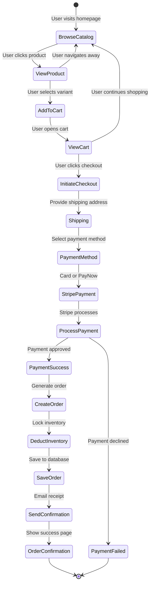

<div align="center">

# 🌿 Atelier Arôme
### Illuminated Manuscript E-Commerce Platform

#### Artisanal Aromatherapy • Headless Commerce • Renaissance Aesthetics

[](https://php.net)
[](https://laravel.com)
[](https://nextjs.org)
[](https://www.typescriptlang.org/)
[](LICENSE)
[](MASTER_EXECUTION_PLAN.md)

</div>

---

## ✨ Elevator Pitch

A production-grade headless e-commerce platform for artisanal aromatherapy, featuring a distinctive **"Illuminated Manuscript"** Renaissance-inspired aesthetic that rejects generic e-commerce templates in favor of bespoke design excellence.

**Built for:** Singapore market with GST (9%), PayNow integration, and SingPost shipping.

**Architecture:** Laravel 12 API + Next.js 15 Frontend (Headless Commerce)

---

## 🎯 Why Atelier Arôme?

### Design Philosophy: Anti-Generic 🎨

We deliberately reject:
- ❌ Inter/Roboto/system font "safety"
- ❌ Purple-gradient-on-white clichés
- ❌ Predictable card grids and hero sections
- ❌ Homogenized "AI slop" aesthetics

Instead, we emphasize:
- ✅ **Renaissance-inspired "Illuminated Manuscript"** visual language
- ✅ Custom Tailwind theme with Cormorant Garamond, Crimson Pro, Great Vibes fonts
- ✅ Alchemical and botanical themes aligned with aromatherapy heritage
- ✅ **WCAG AAA accessibility** with reduced motion support

### Technical Excellence 🏗️

- **Enterprise Architecture:** Headless commerce with Laravel 12 API + Next.js 15 frontend
- **Security-First:** OWASP Top 10 mitigation, PCI compliance via Stripe
- **Performance:** 95+ Lighthouse target, <2s page load, edge deployment
- **Scalability:** Support for 10,000+ products, 1,000+ concurrent users
- **Data Integrity:** UUID primary keys, soft deletes, snapshot pattern for orders

### Singapore Localization 🇸🇬

- **GST (9%)** calculated on `subtotal + shipping`
- **PayNow** payment method via Stripe
- **SingPost** shipping API integration
- **SGD currency** with `$` prefix (not `S$`)

---

## 🏗️ Architecture Overview



```mermaid
graph TB
    subgraph "Client Layer"
        U[User Browser]
    end
    
    subgraph "Frontend Layer - Next.js 15"
        FE[Next.js 15 App]
        UI["Components<br/>- Shadcn-UI<br/>- Tailwind Theme<br/>- Framer Motion"]
        STATE["State Management<br/>- Zustand (UI)<br/>- TanStack Query (Server)"]
        FE --> UI
        FE --> STATE
    end
    
    subgraph "API Layer - Laravel 12"
        API[Laravel 12 REST API]
        AUTH[Laravel Sanctum<br/>- Token Auth]
        RES["API Resources<br/>- JSON Transformers"]
        API --> AUTH
        API --> RES
    end
    
    subgraph "Business Logic"
        SERVICE["Services<br/>- GST Service<br/>- Coupon Service<br/>- Order Service"]
        QUEUE["Queue Jobs<br/>- Laravel Horizon<br/>- Email Processing"]
        SERVICE --> QUEUE
    end
    
    subgraph "Data Layer"
        PG[(PostgreSQL 16<br/>- 24 Tables<br/>- UUID PKs)]
        REDIS[(Redis 7.x<br/>- Cache/Session/Queue)]
        MEILI[(Meilisearch<br/>- Full-text Search)]
    end
    
    subgraph "External Services"
        STRIPE[Stripe<br/>- Payments + PayNow]
        SINGPOST[SingPost<br/>- Shipping Tracking]
        CLOUDINARY[Cloudinary<br/>- CDN for Images]
        MAIL[Mailhog<br/>- Email Testing]
    end
    
    U --> FE
    FE -->|JSON API| API
    API --> SERVICE
    SERVICE -->|SQL| PG
    SERVICE -->|Cache/Queue| REDIS
    SERVICE -->|Search Index| MEILI
    API -->|Payment Processing| STRIPE
    API -->|Shipping Updates| SINGPOST
    FE -->|Static Assets| CLOUDINARY
    API --> MAIL
    
    style FE fill:#C9A769
    style API fill:#2A2D26
    style PG fill:#7CB9A0
    style REDIS fill:#B87D7D
    style STRIPE fill:#635BFF
```

### High-Level System Architecture

```mermaid
graph LR
    subgraph "Frontend - Vercel Edge"
        NEXT[Next.js 15<br/>- React 19 + TS 5]
    end
    
    subgraph "Backend - Laravel Forge/Vapor"
        LARAVEL[Laravel 12<br/>- PHP 8.3 + Sanctum]
        FILAMENT[Filament 3.x<br/>- Admin Panel]
        HORIZON[Laravel Horizon<br/>- Queue Dashboard]
    end
    
    subgraph "Infrastructure"
        NEON[(Neon<br/>- PostgreSQL 16)]
        UPSTASH[(Upstash<br/>- Redis 7.x)]
        CLOUDFLARE[Cloudflare<br/>- CDN]
        VERCEL[Vercel<br/>- Edge Network]
    end
    
    subgraph "External Services"
        STRIPE[Stripe<br/>- Payments]
        MEILISEARCH[Meilisearch<br/>- Search]
    end
    
    NEXT -->|JSON API| LARAVEL
    LARAVEL -->|SQL| NEON
    LARAVEL -->|Cache/Queue| UPSTASH
    NEXT -->|Static Assets| VERCEL
    NEXT -->|Images| CLOUDFLARE
    LARAVEL -->|Search Index| MEILISEARCH
    LARAVEL -->|Payment Processing| STRIPE
    
    style NEXT fill:#FAF8F5
    style LARAVEL fill:#2A2D26
    style NEON fill:#7CB9A0
    style UPSTASH fill:#B87D7D
    style STRIPE fill:#635BFF
```



---

## 📁 Project Structure

### Backend (Laravel 12 API)

```
atelier-arome-api/
├── app/
│   ├── Console/
│   │   └── Kernel.php                 # Scheduled commands (cart cleanup)
│   ├── Exceptions/
│   │   └── Handler.php                 # Global exception handling
│   ├── Http/
│   │   ├── Controllers/               # API controllers (auth, products, cart, checkout)
│   │   ├── Middleware/                # Custom middleware (rate limiting, CORS)
│   │   └── Requests/                  # Form request validation
│   ├── Models/                         # Eloquent models (User, Product, Order, etc.)
│   │   ├── User.php                  # HasUuids, SoftDeletes, relationships
│   │   ├── Product.php               # Alchemical properties, scopes
│   │   ├── Order.php                 # Snapshot pattern
│   │   └── ...
│   ├── Services/                        # Business logic services
│   │   ├── GSTService.php            # GST (9%) calculation
│   │   ├── CouponService.php         # Discount logic
│   │   └── OrderService.php         # Order processing
│   └── Providers/                      # Service providers
├── config/
│   ├── cors.php                         # CORS configuration
│   ├── database.php                    # PostgreSQL configuration
│   └── services.php                    # Stripe, SingPost, Meilisearch
├── database/
│   ├── migrations/                     # 24 database migrations
│   │   ├── 0001_01_01_000001_create_users_table.php
│   │   ├── 2024_01_01_000001_create_categories_table.php
│   │   └── ...
│   └── seeders/                       # Seed data (UserSeeder, ProductSeeder, etc.)
│       ├── DatabaseSeeder.php
│       ├── UserSeeder.php
│       ├── CategorySeeder.php
│       ├── ProductSeeder.php
│       └── ...
├── routes/
│   └── api.php                        # API routes (v1 prefix)
├── storage/                             # Logs, cache, sessions
├── tests/                               # PHPUnit/Pest tests
│   ├── Feature/                        # Integration tests
│   └── Unit/                           # Unit tests
├── .env.example                        # Environment variables template
├── artisan                             # Laravel CLI tool
└── composer.json                       # PHP dependencies
```

### Frontend (Next.js 15)

```
atelier-arome-web/
├── src/
│   ├── app/
│   │   ├── (marketing)/                # Route group: about, alchemy, contact
│   │   ├── (shop)/                     # Route group: compendium, collections, search
│   │   ├── (checkout)/                 # Route group: cart, checkout flow
│   │   ├── (account)/                  # Route group: dashboard, orders, addresses
│   │   ├── api/                        # API routes: auth, cart, newsletter
│   │   ├── layout.tsx                  # Root layout (fonts, providers, metadata)
│   │   ├── page.tsx                    # Homepage
│   │   ├── loading.tsx                 # Global loading skeleton
│   │   ├── error.tsx                   # Error boundary
│   │   └── not-found.tsx              # 404 page
│   ├── components/
│   │   ├── ui/                         # Shadcn-UI primitives
│   │   │   └── sheet.tsx               # Radix Dialog wrapper with parchment styling
│   │   ├── hero/                       # Atomic hero components
│   │   │   ├── hero-frame.tsx          # Layout + border ornaments
│   │   │   ├── alchemical-vessel.tsx    # Vessel + liquid animation
│   │   │   ├── botanical-layer.tsx      # Parallax botanical elements
│   │   │   └── hero-section.tsx       # Orchestrator component
│   │   ├── layout/                     # Orchestrator components
│   │   │   └── header.tsx             # Navigation + seal animation
│   │   └── providers/                   # React providers (Query, Theme, Toast)
│   ├── hooks/                           # Custom React hooks
│   ├── lib/                             # Utilities (cn(), API client)
│   │   └── utils.ts                   # Tailwind class merge utility
│   ├── stores/                          # Zustand stores
│   │   └── cart-store.ts              # Cart state with persistence
│   └── types/                           # TypeScript type definitions
├── public/                              # Static assets
├── .env.local.example                   # Environment variables template
├── next.config.ts                      # Next.js configuration (images, headers)
├── tailwind.config.ts                   # Tailwind theme (Illuminated Manuscript + animations)
├── tsconfig.json                        # TypeScript configuration
└── package.json                         # Node.js dependencies
```

**Component Architecture:**
```
Atomic Components (60-120 lines)
├── hero-frame.tsx          # Layout + gold-leaf borders
├── alchemical-vessel.tsx    # SVG vessel + CSS animations
└── botanical-layer.tsx      # Parallax botanical elements

Orchestrator Components (100-150 lines)
├── hero-section.tsx         # Composes atomic + typography + actions
└── header.tsx             # Navigation + mobile menu + cart

State Management (Zustand)
└── cart-store.ts           # Cart state + localStorage persistence
```

### Root Directory

```
atelier-arome/
├── atelier-arome-api/                  # Laravel 12 backend ✅
├── atelier-arome-web/                  # Next.js 15 frontend ✅
├── docker/                              # Docker configuration
│   └── docker-compose.yml              # PostgreSQL, Redis, Mailhog containers
├── docs/                                # Project documentation
│   └── Comprehensive_Project_Understanding.md
├── AGENT.md                            # Claude Code agent guidance
├── Updated_Project_Understanding.md      # Current project state
├── MASTER_EXECUTION_PLAN.md             # 16-phase implementation plan
├── Project_Architecture_Document.md      # Technical specifications
├── index.html                          # Static mockup reference
├── styles.css                          # Design system reference
└── README.md                           # This file
```

---

## 🎨 Design System: Illuminated Manuscript

### Core Design Tokens

```css
:root {
  /* Color System */
  --color-ink: #2A2D26;           /* Deep charcoal text */
  --color-gold: #C9A769;          /* Byzantine gold accents */
  --color-parchment: #FAF8F5;     /* Warm off-white background */

  /* Botanical Accents */
  --color-lavender: #B8A9C9;
  --color-eucalyptus: #7CB9A0;
  --color-bergamot: #F5D489;
  --color-rosehip: #E8B4B8;

  /* Typography */
  --font-display: 'Cormorant Garamond', Georgia, serif;
  --font-body: 'Crimson Pro', Georgia, serif;
  --font-accent: 'Great Vibes', cursive;
}
```

### Custom Components

- **Shadcn-UI Primitives** - Radix UI primitives with Tailwind customization
- **Custom Animations** - liquid-wave, float-botanical, rotate-seal
- **Responsive Design** - Fluid typography with `clamp()` functions
- **Accessibility** - WCAG AA minimum, AAA target

### Color Palette

```mermaid
graph TD
    PRIMARY["Primary Palette"]
    INK["Ink<br/>#2A2D26<br/>Text color"]
    GOLD["Gold<br/>#C9A769<br/>Accents"]
    PARCHMENT["Parchment<br/>#FAF8F5<br/>Background"]
    
    BOTANICAL["Botanical Accents"]
    LAVENDER["Lavender<br/>#B8A9C9<br/>Calming"]
    EUCALYPTUS["Eucalyptus<br/>#7CB9A0<br/>Clarifying"]
    BERGAMOT["Bergamot<br/>#F5D489<br/>Uplifting"]
    ROSEHIP["Rosehip<br/>#E8B4B8<br/>Rare"]
    
    PRIMARY --> INK
    PRIMARY --> GOLD
    PRIMARY --> PARCHMENT
    PRIMARY --> BOTANICAL
    BOTANICAL --> LAVENDER
    BOTANICAL --> EUCALYPTUS
    BOTANICAL --> BERGAMOT
    BOTANICAL --> ROSEHIP
    
    style INK fill:#2A2D26
    style GOLD fill:#C9A769
    style PARCHMENT fill:#FAF8F5
    style LAVENDER fill:#B8A9C9
    style EUCALYPTUS fill:#7CB9A0
    style BERGAMOT fill:#F5D489
    style ROSEHIP fill:#E8B4B8
```



---

## 🚀 Getting Started

### Prerequisites

**Backend (Laravel 12 API):**
- PHP 8.3+
- Composer 2.x
- PostgreSQL 16
- Redis 7.x
- Node.js 20+ (for asset compilation)

**Frontend (Next.js 15):**
- Node.js 20+
- pnpm 8+ (preferred) or npm 10+

### Quick Start with Docker (Recommended) 🐳

**5-Minute Setup:**

```bash
# Clone repository
git clone https://github.com/your-org/atelier-arome.git
cd atelier-arome

# Start all services
docker-compose up -d

# Access services
# - Backend API: http://localhost:8000
# - Frontend: http://localhost:3000
# - Mailhog (email testing): http://localhost:8025
# - PostgreSQL: localhost:5432
# - Redis: localhost:6379

# Setup backend
cd atelier-arome-api
composer install
cp .env.example .env
php artisan key:generate
php artisan migrate
php artisan db:seed

# Setup frontend
cd ../atelier-arome-web
pnpm install
cp .env.local.example .env.local
pnpm dev

# Open browser
# Frontend: http://localhost:3000
# Backend: http://localhost:8000
```

### Manual Setup (Non-Docker) 💻

#### Backend Setup

```bash
# Install PostgreSQL 16 locally
# macOS: brew install postgresql@16
# Ubuntu: sudo apt-get install postgresql-16
# Windows: Download from postgresql.org

# Install Redis 7.x
# macOS: brew install redis
# Ubuntu: sudo apt-get install redis-server
# Windows: Download from redis.io

# Install PHP 8.3+ and Composer
# macOS: brew install php composer
# Ubuntu: sudo apt-get install php8.3 composer
# Windows: Download from php.net

# Create database
createdb atelier_arome_dev

# Setup backend
cd atelier-arome-api
composer install
cp .env.example .env
php artisan key:generate

# Configure .env (edit with your credentials)
# DB_CONNECTION=pgsql
# DB_HOST=127.0.0.1
# DB_PORT=5432
# DB_DATABASE=atelier_arome_dev
# DB_USERNAME=postgres
# DB_PASSWORD=your_password

# REDIS_HOST=127.0.0.1
# REDIS_PORT=6379

# Run migrations and seed data
php artisan migrate
php artisan db:seed

# Start backend server
php artisan serve
# Backend now running on http://localhost:8000
```

#### Frontend Setup

```bash
# Install Node.js 20+ and pnpm
# macOS: brew install node pnpm
# Ubuntu: sudo apt-get install nodejs npm
# Windows: Download from nodejs.org
# Then: npm install -g pnpm

# Setup frontend
cd atelier-arome-web
pnpm install

# Configure environment
cp .env.local.example .env.local

# Edit .env.local (set API URL)
# NEXT_PUBLIC_API_URL=http://localhost:8000/api/v1

# Generate NEXTAUTH_SECRET
# macOS/Linux:
openssl rand -base64 32
# Windows PowerShell:
[Convert]::ToBase64String((New-Object Security.Cryptography.RNGCryptoServiceProvider).GetBytes(32))).Replace('=','')

# Start frontend dev server
pnpm dev
# Frontend now running on http://localhost:3000
```

### Cross-Platform Deployment Guide

#### macOS

```bash
# Install Homebrew (if not installed)
/bin/bash -c "$(curl -fsSL https://raw.githubusercontent.com/Homebrew/install/HEAD/install.sh)"

# Install dependencies
brew install postgresql@16 redis php@8.3 composer node pnpm

# Create PostgreSQL user and database
createdb atelier_arome_dev

# Follow manual setup steps above
```

#### Linux (Ubuntu/Debian)

```bash
# Update package list
sudo apt-get update

# Install dependencies
sudo apt-get install -y postgresql-16 postgresql-client-16
sudo apt-get install -y redis-server
sudo apt-get install -y php8.3 php8.3-pgsql php8.3-redis composer
sudo apt-get install -y nodejs npm

# Install pnpm globally
npm install -g pnpm

# Start PostgreSQL and Redis
sudo systemctl start postgresql
sudo systemctl start redis-server

# Create database
sudo -u postgres createdb atelier_arome_dev

# Follow manual setup steps above
```

#### Windows

```bash
# Install Chocolatey (if not installed)
Set-ExecutionPolicy Bypass -Scope Process -Force; [System.Net.ServicePointManager]::SecurityProtocol = [System.Net.ServicePointManager]::SecurityProtocolType]3072; iex ((New-Object System.Net.WebClient).DownloadString('https://community.chocolatey.org/install.ps1'))

# Install dependencies
choco install postgresql16 redis php composer nodejs-lts

# Install pnpm via npm
npm install -g pnpm

# Start PostgreSQL and Redis services
# PostgreSQL: Start from Services.msc
# Redis: Run as service or use WSL2

# Follow manual setup steps above
```

---

## 🗄️ Database Schema

**24 Tables Total (22 business + migrations + sessions)**

### Core Tables (24)

| Category | Tables | Key Features |
|----------|--------|-------------|
| **Core Auth** (3) | users, password_reset_tokens, sessions | UUID PKs, role enum, soft deletes |
| **Products & Categories** (7) | categories, products, product_variants, product_images, tags, product_tag, inventories, inventory_movements | Alchemical properties, JSONB meta_data |
| **Shopping Cart** (2) | carts, cart_items | Guest/auth support, expires_at cleanup |
| **Orders** (5) | orders, order_items, payments, addresses, coupons, coupon_usages | Snapshot pattern, order_number: AA-YYYYMMDD-XXXX |
| **User Data** (4) | reviews, testimonials, wishlists, wishlist_items, newsletter_subscribers | Verified purchases, illuminated styling |
| **System** (3) | settings, migrations | Key-value store, migration tracking |

### Critical Relationships



---

## 🔐 Authentication & Security

### Authentication Flow



### Security Features

- **OWASP Top 10 Mitigations:** SQL injection, XSS, CSRF, authentication, authorization
- **Rate Limiting:** 60 requests/minute per IP
- **Password Security:** bcrypt hashing, secure reset tokens
- **API Security:** Sanctum token authentication, CORS configuration
- **Payment Security:** PCI compliance offloaded to Stripe, webhook verification

---

## 🛒 E-Commerce Flow

### Product to Order Journey



### GST Calculation (Singapore)

```php
// GST Service Example
$subtotal = 100.00;      // Products
$shipping = 15.00;       // SingPost shipping

$taxableAmount = $subtotal + $shipping;  // $115.00
$gst = $taxableAmount * 0.09;         // $10.35
$total = $taxableAmount + $gst;          // $125.35

// Display
// Subtotal: $100.00
// Shipping: $15.00
// GST (9%): $10.35
// Total: $125.35
```

---

## 🧪 Testing

### Backend Testing

```bash
# Run all tests
cd atelier-arome-api
php artisan test

# Run specific test suite
php artisan test --testsuite=Feature
php artisan test --testsuite=Unit

# Run with coverage
php artisan test --coverage

# Test structure
tests/
├── Feature/           # Integration tests (API, database)
│   ├── Api/
│   │   ├── AuthTest.php
│   │   ├── ProductTest.php
│   │   ├── CartTest.php
│   │   └── CheckoutTest.php
│   └── Admin/
│       └── ProductManagementTest.php
└── Unit/              # Unit tests (services, models)
    ├── Services/
    │   ├── GSTServiceTest.php
    │   └── CouponServiceTest.php
    └── Models/
        └── ProductTest.php
```

### Frontend Testing

```bash
# Unit tests (Vitest)
cd atelier-arome-web
pnpm test

# E2E tests (Playwright)
pnpm test:e2e

# Test structure
src/
├── __tests__/
│   ├── components/
│   │   ├── essence-card.test.tsx
│   │   └── vial-drawer.test.tsx
│   └── utils/
│       └── format-currency.test.ts
└── e2e/
    ├── checkout.spec.ts
    └── product-browsing.spec.ts
```

---

## 🔧 Troubleshooting

### Build Errors

**JSX Syntax Errors**

**Symptom:**
```
Error: x Expression expected
     ,-[/src/app/page.tsx:285:1]
285 |                       </button>
     :                 ^
```

**Cause:** Unclosed JSX tags or template literal backticks in attributes

**Solution:** "Construct and Conquer" Strategy
1. Create new clean component files
2. Write semantic HTML + Tailwind (no template literals in JSX)
3. Overwrite broken page.tsx with new structure
4. Run `pnpm run build`

**Example:**
```bash
# Step 1: Create component
mkdir -p src/components/hero
touch src/components/hero/hero-frame.tsx

# Step 2: Write clean JSX
export function HeroFrame({ children }: { children: React.ReactNode }) {
  return (
    <section className="bg-parchment border-2 border-gold">
      {children}
    </section>
  );
}

# Step 3: Overwrite page
cp src/app/page.tsx src/app/page.tsx.backup
# Write clean page.tsx importing new component
```

**Module Not Found Errors**

**Symptom:**
```
Module not found: Can't resolve '@/components/ui/sheet'
```

**Solution:**
```bash
# Option 1: Generate with CLI
npx shadcn-ui@latest add sheet

# Option 2: Create manually
touch src/components/ui/sheet.tsx

# Copy Radix Dialog primitive from Shadcn docs
# Apply parchment styling (bg-parchment, border-gold, backdrop-blur-sm)
```

**Font Loading Issues**

**Symptom:** Typography reverts to generic sans-serif

**Solution:** Add font loading to layout.tsx
```typescript
import { Cormorant_Garamond, Crimson_Pro, Great_Vibes } from 'next/font/google';

const cormorant = Cormorant_Garamond({
  weight: ['300', '400', '600', '700'],
  subsets: ['latin'],
  display: 'swap',
  variable: '--font-cormorant',
});

const crimson = Crimson_Pro({
  weight: ['300', '400', '600'],
  subsets: ['latin'],
  display: 'swap',
  variable: '--font-crimson',
});

// Apply to body: className={`${cormorant.variable} ${crimson.variable}`}
```

### Animation Issues

**Tailwind Animations Not Applying**

**Symptom:** Custom animation classes not recognized

**Cause:** Animation defined in globals.css instead of tailwind.config.ts

**Solution:**
```typescript
// tailwind.config.ts
export default {
  theme: {
    extend: {
      keyframes: {
        'seal-rotate': {
          '0%': { transform: 'rotate(0deg)' },
          '100%': { transform: 'rotate(360deg)' },
        },
      },
      animation: {
        'seal-rotate': 'seal-rotate 30s linear infinite',
      },
    },
  },
};
```

### Development Workflow

**"Construct and Conquer" (Build Remediation)**

When encountering JSX/build errors:
1. ✅ Create new component files (clean slate)
2. ✅ Write semantic HTML + Tailwind utilities
3. ✅ Overwrite broken file (don't debug line-by-line)
4. ✅ Run `pnpm run build` to verify
5. ✅ Test in dev server

**Common Pitfalls:**
- ❌ Debugging line-by-line (wastes time)
- ❌ Fixing template literals in broken file (risk of cascade errors)
- ❌ Adding animations to globals.css (not Tailwind-compliant)
- ✅ Creating clean components (atomic design pattern)
- ✅ Using Tailwind animation utilities (defined in tailwind.config.ts)

---

## 📚 API Documentation

### Authentication Endpoints

```http
POST /api/v1/auth/login
Content-Type: application/json

{
  "email": "user@example.com",
  "password": "password123"
}

Response: 200 OK
{
  "data": {
    "token": "1|abc123...",
    "user": {
      "id": "uuid-here",
      "name": "User Name",
      "email": "user@example.com",
      "role": "customer"
    }
  }
}
```

### Product Endpoints

```http
GET /api/v1/products
GET /api/v1/products?humour=calming
GET /api/v1/products?rarity=rare
GET /api/v1/products?featured=true
GET /api/v1/products/{slug}

Response: 200 OK
{
  "data": [...],
  "meta": {
    "current_page": 1,
    "per_page": 12,
    "total": 47
  },
  "links": {
    "self": "/api/v1/products?page=1",
    "next": "/api/v1/products?page=2"
  }
}
```

### Cart Endpoints

```http
GET    /api/v1/cart
POST   /api/v1/cart/items
PATCH  /api/v1/cart/items/{id}
DELETE /api/v1/cart/items/{id}
POST   /api/v1/cart/coupon
```

### Checkout Flow

```http
POST /api/v1/checkout/initiate         # Validate cart
POST /api/v1/checkout/shipping         # Set address
POST /api/v1/checkout/payment-intent   # Create Stripe PaymentIntent
POST /api/v1/checkout/confirm          # Place order + charge
```

---

## 🤝 Contributing

We welcome contributions! Please follow these guidelines:

### Development Workflow

```bash
# 1. Fork repository
# 2. Create feature branch
git checkout -b feature/your-feature-name

# 3. Make changes
# 4. Follow code style (Laravel Pint, Prettier)
./vendor/bin/pint  # Backend
pnpm format      # Frontend

# 5. Run tests
php artisan test  # Backend
pnpm test        # Frontend

# 6. Commit changes
git add .
git commit -m "feat: your description"

# 7. Push and create PR
git push origin feature/your-feature-name
```

### Code of Conduct

- Be respectful and inclusive
- Provide constructive feedback
- Focus on what is best for the community
- Respect different viewpoints and experiences

### Areas for Contribution

- **Frontend Components:** New UI components, animations, design system
- **Backend Features:** API endpoints, services, business logic
- **Documentation:** Guides, tutorials, examples
- **Tests:** Unit tests, E2E tests, coverage improvements
- **Performance:** Optimization, caching, indexing
- **Accessibility:** Screen reader support, keyboard navigation, ARIA labels

---

## 📦 Deployment

### Development Deployment

```bash
# Docker (recommended)
docker-compose up -d

# Manual
cd atelier-arome-api && php artisan serve
cd atelier-arome-web && pnpm dev
```

### Production Deployment

#### Frontend (Vercel)

```bash
# Install Vercel CLI
npm install -g vercel

# Deploy
cd atelier-arome-web
vercel

# Environment Variables (Vercel Dashboard)
NEXT_PUBLIC_API_URL=https://api.atelierarome.com/api/v1
NEXTAUTH_URL=https://atelierarome.com
NEXTAUTH_SECRET=your-generated-secret
NEXT_PUBLIC_STRIPE_PUBLISHABLE_KEY=pk_live_...
```

#### Backend (Laravel Forge)

```bash
# 1. Connect repository to Laravel Forge
# 2. Create server (DigitalOcean, AWS, etc.)
# 3. Configure environment
# 4. Deploy via git push

# Environment Variables (Forge Dashboard)
APP_ENV=production
APP_DEBUG=false
APP_URL=https://api.atelierarome.com
DB_CONNECTION=pgsql
# Add Neon database credentials
REDIS_HOST=upstash-redis-url
STRIPE_SECRET=sk_live_...
STRIPE_WEBHOOK_SECRET=whsec_...
```

#### Database (Neon)

```bash
# 1. Sign up at neon.tech
# 2. Create PostgreSQL 16 database
# 3. Get connection string
# 4. Update Laravel .env
# 5. Run migrations
php artisan migrate --force
```

#### Cache/Queue (Upstash)

```bash
# 1. Sign up at upstash.com
# 2. Create Redis database
# 3. Get connection string
# 4. Update Laravel .env
REDIS_CONNECTION=upstash
UPSTASH_REDIS_REST_URL=...
```

### Monitoring

- **Error Tracking:** Sentry (https://sentry.io)
- **Analytics:** Plausible (https://plausible.io)
- **Uptime Monitoring:** UptimeRobot or Pingdom

---

## 🗺️ Roadmap

### Current Status: Phase 3 Complete ✅

- [x] Project structure created
- [x] Database schema designed (24 tables)
- [x] Migrations and seeders implemented
- [x] Laravel 12 API scaffolded
- [x] Next.js 15 frontend initialized
- [x] Docker infrastructure configured
- [x] Illuminated Manuscript design system created
- [x] Atomic component architecture established
- [x] Zustand cart store with persistence
- [x] Tailwind animation utilities configured
- [x] Build error resolved (JSX syntax elimination)
- [x] Zero TypeScript errors, Zero ESLint warnings
- [x] Dev server running on http://localhost:3000

### Upcoming Phases

| Phase | Name | Duration | Status |
|-------|------|----------|--------|
| 1 | Foundation | 3 days | ✅ Complete |
| 2 | Backend Core | 5 days | 🚀 In Progress |
| 3 | Frontend Foundation | 3 days | ✅ Complete |
| 4 | Design System | 5 days | ✅ Complete |
| 5 | Authentication | 5 days | ⏳ Upcoming |
| 6 | Product Management (BE) | 5 days | ⏳ Upcoming |
| 7 | Product Catalog (FE) | 7 days | ⏳ Upcoming |
| 8 | Cart System | 5 days | ⏳ Upcoming |
| 9 | Checkout Flow | 7 days | ⏳ Upcoming |
| 10 | Payment Integration | 5 days | ⏳ Upcoming |
| 11 | Order Management | 5 days | ⏳ Upcoming |
| 12 | User Account Pages | 5 days | ⏳ Upcoming |
| 13 | Admin Panel | 7 days | ⏳ Upcoming |
| 14 | Search & Filtering | 4 days | ⏳ Upcoming |
| 15 | Email & Notifications | 4 days | ⏳ Upcoming |
| 16 | Testing & Launch | 10 days | ⏳ Upcoming |

### Long-term Vision

- [ ] Multi-currency support (expand beyond SGD)
- [ ] International shipping options
- [ ] AI-powered product recommendations
- [ ] Advanced analytics dashboard
- [ ] Mobile app (React Native)
- [ ] GraphQL API (alternative to REST)
- [ ] Headless CMS integration

---

## 📖 Documentation

- **[AGENT.md](AGENT.md)** - Developer guidelines and technical specifications
- **[Updated_Project_Understanding.md](Updated_Project_Understanding.md)** - Current project state and deep understanding
- **[MASTER_EXECUTION_PLAN.md](MASTER_EXECUTION_PLAN.md)** - Phase-by-phase implementation plan (16 phases, 85 days)
- **[Project_Architecture_Document.md](Project_Architecture_Document.md)** - Complete technical specification
- **[PHASE_1_EXECUTION_PLAN.md](PHASE_1_EXECUTION_PLAN.md)** - Phase 1 detailed breakdown
- **[DAY_3_COMPLETION_SUMMARY.md](DAY_3_COMPLETION_SUMMARY.md)** - Phase 1 completion status

---

## 📄 License

Proprietary - Atelier Arôme © 2026

All rights reserved. This project is proprietary software developed for Atelier Arôme.

---

## 🙏 Acknowledgments

- **Laravel** - PHP framework excellence
- **Next.js** - React framework for production
- **Shadcn-UI** - Beautiful, accessible components
- **Radix UI** - Unstyled, accessible primitives
- **Tailwind CSS** - Utility-first CSS framework
- **Stripe** - Payment infrastructure
- **PostgreSQL** - Open-source relational database
- **Redis** - In-memory data structure store

---

<div align="center">

### Built with 🌿 Artisanal Craftsmanship

**[Back to Top](#-atelier-arôme)**

</div>
