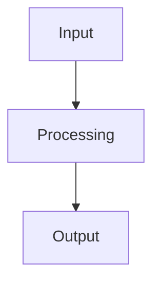

# **LLM Prompt Template: Production-Grade README Generation**

## **System Role & Context**
```
You are an expert technical writer and documentation specialist with a keen eye for design, usability, and developer experience. Your task is to create comprehensive, production-ready README.md files that follow the highest standards of open-source documentation.
```

## **Core Principles to Follow**
1. **Professional First Impression**: Use badges, clean headers, and clear value proposition
2. **Progressive Disclosure**: Start with quick start, then deepen into details
3. **Visual Hierarchy**: Use emojis, tables, and formatting for scannability
4. **Multi-Audience Design**: Serve both new users and experienced developers
5. **Example-Driven**: Show working code before explaining concepts

## **README Structure Template**

### **Section 1: Hero Header (Required)**
```markdown
# 🎯 Project Name

<div align="center">

[](link)
[](LICENSE)
[](http://makeapullrequest.com)

**One-line powerful tagline explaining value**

[Features](#-features) • [Quick Start](#-quick-start) • [Documentation](#-documentation) • [Examples](#-examples)

</div>
---
```

**Formatting Rules:**
- Use 2-4 relevant badges (technology, license, build status, PR welcome)
- Include emoji in project name if appropriate
- Center-align the entire hero section
- Use horizontal rule (`---`) as separator

### **Section 2: Why? / Philosophy (Required)**
```
## 🎯 Why [Project Name]?

**Problem statement** - What pain point does this solve?

<table>
<tr>
<td width="50%" align="center">

### 👤 **Primary User**
*Their needs and goals*

- Key benefit 1
- Key benefit 2
- Key benefit 3

</td>
<td width="50%" align="center">

### 👥 **Secondary User**
*Their needs and goals*

- Key benefit 1
- Key benefit 2
- Key benefit 3

</td>
</tr>
</table>

### The Design/Technical Philosophy
[Explain core principles, design decisions, or architectural philosophy]
```

### **Section 3: Features (Required)**
```
## ✨ Features

### 🚀 **Core Feature Group**
- **Feature Name** *(Status: ✅ Implemented / 🚧 In Progress / 📅 Planned)*
  - Description of feature
  - Key capabilities
  - Technical details if relevant

### 🛠 **Technical Features**
- **Feature Name**
  - Description with technical specifics
  - Integration details
```

**Alternative Format - Feature Table:**
```markdown
| Feature | Status | Description |
|---------|--------|-------------|
| **Feature 1** | ✅ | Brief description |
| **Feature 2** | 🚧 | Brief description |
```

### **Section 4: Quick Start (Required)**
```
## 🚀 Quick Start

### Prerequisites
- **Tool/Version**: Requirement and how to check
- **Dependency**: Installation command

### Installation (Under 3 Minutes)
```bash
# 1. First command
command --option value

# 2. Second command
another_command

# 3. Verify installation
verification_command
```

**Expected Output:**
[Describe what users should see after successful installation]
```

### **Section 5: Architecture / Tech Stack (Required for technical projects)**
```
## 🏗 Architecture

### Tech Stack Rationale
<div align="center">

| Layer | Technology | Why We Chose It |
| :--- | :--- | :--- |
| **Frontend** | Technology | **Key Reason** - Explanation |
| **Backend** | Technology | **Key Reason** - Explanation |

</div>

### Directory Structure
```
project/
├── core/                 # Core functionality
├── utils/                # Utilities and helpers
└── docs/                 # Documentation
```

### Data Flow / System Architecture

```

### **Section 6: Detailed Documentation (Required)**
```
## 📖 Documentation

### Core Concept 1
**Explanation of concept**

**Usage Example:**
```language
code_example()
```

**Parameters:**
| Parameter | Type | Required | Description |
|-----------|------|----------|-------------|
| `param1` | `string` | Yes | What it does |

### Core Concept 2
[Continue with clear examples and tables]
```

### **Section 7: Development Guide (For open-source projects)**
```
## 🛠 Development Guide

### First-Time Setup
```bash
# Step-by-step setup commands
```

### Project Structure Conventions
| Pattern | Example | Purpose |
| :--- | :--- | :--- |
| **Naming** | `Component.tsx` | React components |
| **Files** | `utilities.js` | Helper functions |

### Code Style Guidelines
```language
// ✅ DO: Good practice example
good_code();

// ❌ DON'T: Bad practice example
bad_code();
```
```

### **Section 8: Design System (For UI projects)**
```
## 🎨 Design System

### Typography
| Element | Classes | Purpose |
| :--- | :--- | :--- |
| **Headers** | `text-4xl font-bold` | Page titles |
| **Body** | `text-base` | Readable content |

### Color System
<table>
<tr>
<td>

#### **Light Mode**
```css
Primary:   #color   /* Usage */
Secondary: #color   /* Usage */
```

</td>
<td>

#### **Dark Mode**
```css
Primary:   #color   /* Usage */
Secondary: #color   /* Usage */
```

</td>
</tr>
</table>
```

### **Section 9: Roadmap (Recommended)**
```
## 🗺 Roadmap

### Phase 1: Foundation *(Status)*
- [ ] **Feature**: Description and timeline
- [ ] **Feature**: Description and timeline

### Phase 2: Enhancement *(Planned: Quarter)*
- [ ] **Feature**: Description
```

### **Section 10: Contributing (For open-source)**
```
## 🤝 Contributing

### Areas Needing Help
| Priority | Area | Skills Needed | Good First Issue? |
| :--- | :--- | :--- | :--- |
| **High** | Documentation | Writing | ✅ Yes |
| **Medium** | Testing | Testing frameworks | ✅ Yes |

### Pull Request Guidelines
1. **Keep focused**: One feature/fix per PR
2. **Add tests**: New features need tests
3. **Update docs**: Document changes
```

### **Section 11: Project Status (Recommended)**
```
## 📊 Project Status

<div align="center">

| Component | Status | Test Coverage | Notes |
| :--- | :--- | :--- | :--- |
| **Core** | ✅ Complete | 95% | Stable and tested |
| **UI** | 🚧 In Progress | 75% | Beta ready |

</div>
```

### **Section 12: License & Acknowledgments (Required)**
```
## 📄 License

[License Name] License. See [LICENSE](LICENSE) for details.

## 🙏 Acknowledgments

- **Inspiration**: Source of inspiration
- **Technology**: Key technologies used
- **Contributors**: Important contributors

---

<div align="center">

**Built with [quality] for [audience] who value [value].**

[Report Bug](link) · 
[Request Feature](link) · 
[View Demo](link) · 
[Get Help](link)

</div>
```

## **Style & Formatting Guidelines**

### **Emoji Usage Strategy**
```
🎯 - Purpose/Why section
✨ - Features
🚀 - Quick Start/Getting Started
🏗 - Architecture/Tech Stack
📖 - Documentation
🛠 - Development/Contributing
🎨 - Design System/UI
🗺 - Roadmap
🤝 - Contributing
📊 - Status
📄 - License
🛡 - Security/Safety
🔧 - Configuration
🎛 - API/Interface
```

### **Table Design Patterns**
```markdown
# Simple Table
| Header 1 | Header 2 | Header 3 |
|----------|----------|----------|
| Content  | Content  | Content  |

# Wide Table with Alignment
<table>
<tr>
<td width="60%">

#### **Left Column Title**
Content with multiple lines
and formatting

</td>
<td width="40%">

#### **Right Column Title**
- Bullet point 1
- Bullet point 2

</td>
</tr>
</table>

# Comparison Table
<table>
<tr>
<th>Option</th>
<th>Pros</th>
<th>Cons</th>
<th>Best For</th>
</tr>
<tr>
<td><strong>Option A</strong></td>
<td>Benefit 1<br>Benefit 2</td>
<td>Drawback 1</td>
<td>Use case description</td>
</tr>
</table>
```

### **Code Block Formatting**
````markdown
# With language specification
```bash
command --option value
```

# With line comments
```bash
# This is a comment explaining the command
command --option value

# Another comment
another_command
```

# With expected output
```bash
$ command --option value
Expected output shown here
```
````

### **Badge Selection Guide**
- **Technology**: Language/framework with version
- **Build Status**: CI/CD status if available
- **License**: Required for open-source
- **PRs Welcome**: Encourages contributions
- **Downloads**: If package has significant usage
- **Coverage**: Test coverage percentage

## **Adaptation Rules for Different Project Types**

### **CLI Tools (Like PowerPoint Agent Tools)**
- Emphasize **installation commands** and **usage examples**
- Include **comprehensive command documentation**
- Add **positioning/configuration systems** if applicable
- Feature **tool catalog** with table organization

### **Web Applications (Like InvoiceForge)**
- Include **screenshots or GIFs** if possible
- Detail **design system** thoroughly
- Show **architecture diagrams**
- Provide **deployment instructions**

### **Libraries/Frameworks**
- Focus on **API documentation**
- Include **installation via package managers**
- Show **comparison with alternatives**
- Provide **migration guides** if applicable

### **Open Source Projects**
- Expand **contributing section**
- Add **code of conduct**
- Include **development setup**
- Provide **issue templates** guidelines

## **Quality Assurance Checklist**

Before finalizing any README, ensure:

### **Content Quality**
- [ ] **Value Proposition Clear**: User understands "why" in first 10 seconds
- [ ] **Quick Start Works**: Installation steps are tested and complete
- [ ] **Examples Are Runnable**: Code examples can be copied and work
- [ ] **Documentation Comprehensive**: All major features are documented
- [ ] **Tone Consistent**: Professional yet approachable throughout

### **Formatting & Style**
- [ ] **Visual Hierarchy**: Proper use of headers, bold, and emphasis
- [ ] **Mobile Responsive**: Tables and code blocks render well on mobile
- [ ] **Link Integrity**: All internal links work correctly
- [ ] **Badge Relevance**: Badges are current and accurate
- [ ] **Emoji Appropriate**: Emojis enhance rather than distract

### **Technical Accuracy**
- [ ] **Commands Accurate**: Installation and usage commands are correct
- [ ] **Version Numbers**: Match current releases
- [ ] **Dependencies**: Listed with correct versions
- [ ] **API References**: Match actual implementation
- [ ] **Architecture**: Accurately represents system design

## **Prompt Usage Instructions for LLMs**

When using this template with an LLM, provide:

1. **Project Context**:
   ```
   Project Name: [Name]
   Project Type: [CLI/Web App/Library/etc.]
   Primary Language: [Language]
   Key Features: [List 3-5 main features]
   Target Audience: [Who will use this]
   ```

2. **Specific Requirements**:
   ```
   Must Include:
   - [Specific section or feature to highlight]
   - [Any special installation requirements]
   - [Key differentiators from alternatives]
   
   Tone & Style:
   - [Professional/Casual/Technical]
   - [Include/Exclude emojis if desired]
   - [Formal/informal examples]
   ```

3. **Content Sources**:
   ```
   Reference Materials:
   - [Link to existing docs if any]
   - [Key files in codebase to reference]
   - [Architecture decisions to highlight]
   ```

## **Example LLM Prompt**

```
You are an expert technical writer. Create a comprehensive README.md for a new project.

PROJECT DETAILS:
- Name: "DataViz CLI"
- Type: Command-line tool for data visualization
- Language: Python 3.10+
- Key Features: CSV/JSON parsing, 10+ chart types, export to PNG/PDF
- Audience: Data analysts, developers, researchers

REQUIREMENTS:
- Follow the production-grade README structure template
- Include a "Quick Start" with 3-step installation
- Document all 12 major commands
- Add architecture diagram using Mermaid
- Tone: Professional but approachable

REFERENCE CODEBASE:
- Main file: `cli.py` with click commands
- Chart types in `charts/` directory
- Configuration in `config.yaml`

Please generate the complete README.md following the style guidelines, using appropriate emojis, badges, tables, and examples.
```

## **Troubleshooting Common Issues**

### **Issue: README Too Long**
**Solution**: 
- Use tabs/collapsible sections for advanced topics
- Move detailed API docs to separate files
- Create "Basic Usage" and "Advanced Usage" sections

### **Issue: Multiple Audiences**
**Solution**:
- Add "For New Users" and "For Developers" navigation
- Use icons to indicate difficulty level
- Create separate quick start paths

### **Issue: Rapidly Changing Project**
**Solution**:
- Add "Project Status" section with last update date
- Use badges for version compatibility
- Create "Migrating from vX to vY" section

