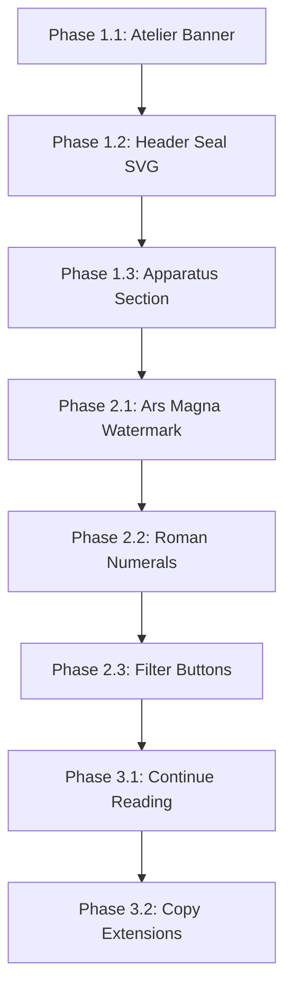

# Visual Alignment Remediation Plan: Dynamic Landing Page to Static HTML Reference

## Executive Summary

After meticulous comparison of the dynamic Next.js landing page (`landing_page.html`) against the static HTML reference mockup (`index.html`, `styles.css`, `main.js`), and validation against the existing gap analysis documents, I've identified **8 key visual alignment gaps** that need remediation.

**Important Constraints:**
- The current frontend code uses **custom BEM classes** in `atelier.css` (4212 lines)
- All changes must preserve **architectural integrity and functionality**
- Focus is on **visual UI/UX aesthetic alignment only**

---

## Validation of Existing Gap Analysis Documents

### ✅ Confirmed Findings from `gap_analysis_dynamic_land_page_vs_static.md`

| Finding | Status | My Assessment |
|---------|--------|---------------|
| Missing Atelier Hours Banner | ✅ Confirmed | Static has `.atelier-banner` with "The Atelier is Open" / "N° 724 • Lavandula × intermedia" |
| Header seal simplified | ✅ Confirmed | Static has elaborate `.header__seal-svg` with alchemical paths; dynamic shows simpler version |
| Compendium product differences | ✅ Confirmed | Static: 12 essences (Provence Lavender, etc.); Dynamic: 3 essences with different names |
| Missing "Continue Reading" button | ✅ Confirmed | Static has `#loadMoreEssences` button; dynamic has counter only |
| Alchemy section watermark | ✅ Confirmed | Static has "Ars Magna" watermark; dynamic has SVG geometric watermark |
| Process step differences | ⚠️ Partial | Static uses Roman numerals (I, II, etc.) vs Arabic (1, 2, etc.) |
| Apparatus illustrations | ✅ Confirmed | Static has `.alchemy__apparatus` with 3 items; dynamic is missing this entirely |

### ✅ Confirmed Findings from `gap_analysis_remediation_plan.md`

| Phase | Finding | Status | My Assessment |
|-------|---------|--------|---------------|
| Phase 1.1 | Manuscript border frame | ⚠️ Partial | Current CSS has `.hero__border-corner` but simpler than reference |
| Phase 1.2 | Rotating alchemical seal | ✅ Already Implemented | `@keyframes rotateSeal` exists in atelier.css (line 373-376) |
| Phase 1.3 | Gold leaf accent system | ⚠️ Partial | `.gold-leaf--1/2/3` exist but could be enhanced |
| Phase 2 | Typography hierarchy | ✅ Already Implemented | Fluid `clamp()` typography exists in CSS custom properties |
| Phase 3 | Essence card ornamentation | ⚠️ Needs Work | Cards functional but missing decorative corner ornaments |

---

## Visual Gap Inventory (Prioritized)

### 🔴 CRITICAL (Must Fix for Visual Parity)

#### Gap 1: Missing Atelier Hours Banner
**Location:** Above header
**Static Reference:** Lines 52-60 of `index.html`
**Current State:** Not present in dynamic page
**Impact:** High - First visual element users see

#### Gap 2: Simplified Header Seal SVG
**Location:** `.header__seal-svg`
**Static Reference:** Lines 68-73 of `index.html` - Complex alchemical symbol with dashed circle, ornate paths
**Current State:** Simplified seal with basic circles and "A" text
**Impact:** Medium-High - Brand identity element

#### Gap 3: Missing Apparatus Illustrations Section
**Location:** Alchemy section footer
**Static Reference:** Lines 724-737 of `index.html` - Three apparatus items (Copper Alembic, Maturation Vessels, Tools)
**Current State:** Missing entirely
**Impact:** High - Visual storytelling gap

### 🟡 HIGH (Recommended for Full Parity)

#### Gap 4: Alchemy Section Watermark Text ("Ars Magna")
**Location:** `.alchemy__watermark`
**Static Reference:** Lines 607-609 - Text watermark "Ars Magna"
**Current State:** Geometric SVG watermark instead
**Impact:** Medium - Atmospheric detail

#### Gap 5: Process Step Roman Numerals
**Location:** `.alchemy-step__number`
**Static Reference:** Uses Roman numerals (I, II, III, IV) with `.alchemy-step__roman`
**Current State:** Uses Arabic numerals (1, 2, 3, 4)
**Impact:** Medium - Aesthetic consistency

#### Gap 6: Filter Button Structure
**Location:** `.compendium__filters`
**Static Reference:** Separate text and ornament spans per filter
**Current State:** Simplified button structure
**Impact:** Medium - Interaction affordance

### 🟢 MINOR (Polish and Refinement)

#### Gap 7: Compendium Footer Structure
**Location:** `.compendium__footer`
**Static Reference:** "3 of 12 Essences Documented" + "Continue Reading" button
**Current State:** "3 / 3 Essences" counter without load more button
**Impact:** Low - Pagination UX

#### Gap 8: Section Description Copy Length
**Location:** Multiple section descriptions
**Static Reference:** Longer, more poetic descriptions
**Current State:** Shortened versions
**Impact:** Low - Content polish

---

## Remediation Plan with ToDo Checklist

### Phase 1: Critical Visual Elements

#### 1.1 Add Atelier Hours Banner
**Files to Modify:**
- `atelier-arome-web/src/app/page.tsx` (add banner component)
- `atelier-arome-web/src/app/atelier.css` (styles already exist at lines 269-316)

**Todo:**
- [ ] Add `<div class="atelier-banner">` before header in page.tsx
- [ ] Verify `.atelier-banner__container` content matches static reference
- [ ] Test responsive behavior at 768px breakpoint

**BEM Classes to Use (Already Exist):**
```css
.atelier-banner
.atelier-banner__container
.atelier-banner__icon
.atelier-banner__text
.atelier-banner__subtext
```

---

#### 1.2 Enhance Header Seal SVG
**Files to Modify:**
- `atelier-arome-web/src/components/layout/header.tsx`

**Todo:**
- [ ] Replace simplified SVG with reference paths from index.html lines 68-73
- [ ] Include dashed circle, ornate paths, and cross pattern
- [ ] Verify rotation animation still works (`@keyframes rotateSeal`)

**Target SVG Structure (from static):**
```jsx
<svg viewBox="0 0 100 100">
  <circle cx="50" cy="50" r="48" fill="none" stroke="currentColor" strokeWidth="1" strokeDasharray="2,2"/>
  <path d="M50 20 Q70 30 80 50 Q70 70 50 80 Q30 70 20 50 Q30 30 50 20 Z" fill="none" stroke="currentColor" strokeWidth="1.5"/>
  <circle cx="50" cy="50" r="15" fill="none" stroke="currentColor" strokeWidth="1"/>
  <path d="M50 35 L50 65 M35 50 L65 50" stroke="currentColor" strokeWidth="1.5"/>
</svg>
```

---

#### 1.3 Add Apparatus Illustrations Section
**Files to Modify:**
- `atelier-arome-web/src/components/sections/alchemy-section.tsx`
- `atelier-arome-web/src/app/atelier.css` (add styles)

**Todo:**
- [ ] Add `.alchemy__apparatus` container after `.alchemy__process`
- [ ] Add 3 `.apparatus__item` elements (still, vessel, tools)
- [ ] Add CSS for grid layout and illustration placeholders
- [ ] Add caption text below each apparatus item

**BEM Classes to Create:**
```css
.alchemy__apparatus {
  display: grid;
  grid-template-columns: repeat(3, 1fr);
  gap: var(--space-xl);
  margin-top: var(--space-4xl);
}

.apparatus__item { /* Centered item container */ }
.apparatus__illustration { /* Placeholder for illustration */ }
.apparatus__caption { /* Caption text */ }
```

---

### Phase 2: High Priority Enhancements

#### 2.1 Update Alchemy Watermark to "Ars Magna"
**Files to Modify:**
- `atelier-arome-web/src/components/sections/alchemy-section.tsx`

**Todo:**
- [ ] Replace SVG watermark with text-based watermark
- [ ] Add `.alchemy__watermark-text` span with "Ars Magna"
- [ ] Style with large font-size, low opacity, and uppercase transform

---

#### 2.2 Change Process Steps to Roman Numerals
**Files to Modify:**
- `atelier-arome-web/src/components/sections/alchemy-section.tsx`

**Todo:**
- [ ] Update step number display from Arabic (1, 2, 3, 4) to Roman (I, II, III, IV)
- [ ] Add `.alchemy-step__roman` class for styling
- [ ] Verify color modifiers still work (--nigredo, --albedo, --citrinitas, --rubedo)

---

#### 2.3 Enhance Filter Button Structure
**Files to Modify:**
- `atelier-arome-web/src/components/sections/compendium-section.tsx`

**Todo:**
- [ ] Add `.compendium__filter-text` and `.compendium__filter-icon` spans
- [ ] Update "All" filter to use `.compendium__filter-ornament` (✦)
- [ ] Add humour icons (☾ ☀ ♁ ☁) to respective filters

---

### Phase 3: Polish and Refinement

#### 3.1 Add Compendium "Continue Reading" Button
**Files to Modify:**
- `atelier-arome-web/src/components/sections/compendium-section.tsx`

**Todo:**
- [ ] Add `.btn.btn--outline` after counter
- [ ] Text: "Continue Reading" with arrow icon
- [ ] Implement as link to `/compendium` page

---

#### 3.2 Extend Section Description Copy
**Files to Modify:**
- `atelier-arome-web/src/components/sections/compendium-section.tsx`
- `atelier-arome-web/src/components/sections/alchemy-section.tsx`

**Todo:**
- [ ] Update compendium description to match static reference length
- [ ] Update alchemy description to include "solve et coagula" reference

---

## Implementation Order



## Risk Assessment

| Risk | Mitigation |
|------|------------|
| Breaking existing scroll animations | Test scroll behavior after each change |
| CSS specificity conflicts | Use existing BEM class structure |
| Server/Client component mismatch | Keep decorative elements in server components |
| Build failures | Run `pnpm build` after each phase |
| Accessibility regression | Maintain `aria-hidden="true"` on decorative elements |

## Verification Plan

After each phase:
1. `pnpm build` - Ensure no compilation errors
2. Visual inspection at 1920px, 1024px, 768px, 375px viewports
3. Compare against static reference for specific elements
4. Test interactive elements (hover, focus states)
5. Verify animations still function (seal rotation, scroll effects)

---

## Files Affected Summary

| File | Changes |
|------|---------|
| `src/app/page.tsx` | Add banner, verify section order |
| `src/components/layout/header.tsx` | Enhance SVG seal |
| `src/components/sections/alchemy-section.tsx` | Apparatus, watermark, roman numerals |
| `src/components/sections/compendium-section.tsx` | Filters, footer button, copy |
| `src/app/atelier.css` | Add `.apparatus__*` and `.alchemy__watermark-text` classes |
