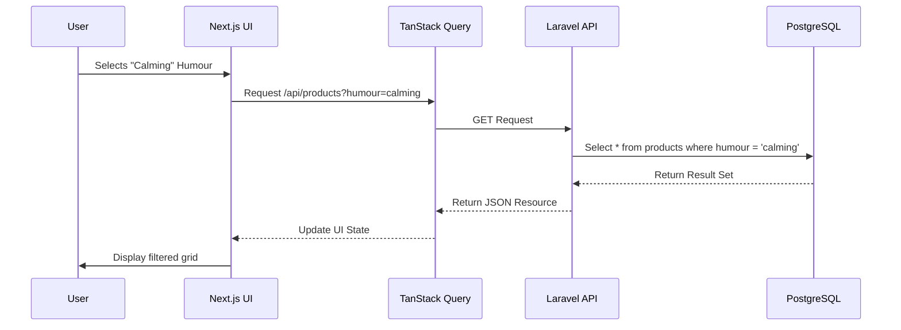

The **Atelier Arôme** project is a **Headless E-commerce Platform** (Laravel 12 + Next.js 15).

**Strategic Pivot:** I will adopt the **structure and rigor** of your example (Module Deep-Dives, Mermaid Diagrams, Data Flows) but populate it entirely with the **Atelier Arôme** architecture (Atomic Design, Alchemical Logic, Snapshot Order Pattern).

# 📝 Implementation Plan: Project Architecture Document (PAD)

**Target Artifact:** `Project_Architecture_Document.md`
**Source of Truth:** `Updated_Project_Understanding.md` (Version 2.0.0)
**Design Philosophy:** "Illuminated Manuscript" (Anti-Generic)

## 1. Document Structure Mapping

| Section | Template (RAG) Example | Atelier Arôme Implementation |
| :--- | :--- | :--- |
| **1.1** | Executive Summary | Headless Commerce overview, "Illuminated Manuscript" differentiator. |
| **1.2** | System Architecture | Laravel 12 API + Next.js 15 (App Router) + PostgreSQL + Redis. |
| **1.3** | File Hierarchy | Monorepo structure (`api/` vs `web/`), highlighting Atomic Components. |
| **1.4** | Interaction Diagrams | Checkout Flow, Cart Synchronization, Product Filtering (Alchemical). |
| **1.5** | Module Deep-Dives | **BE:** Controllers, Resources, Seeders. **FE:** Stores, Orchestrators, Atoms. |
| **1.6** | Data Flow | `addToCart` (Zustand) → API Sync → Redis Session. |
| **1.7** | Configuration | Stripe Keys, SingPost API, Cloudinary, Database Credentials. |
| **1.8** | Deployment | Vercel (Edge) + Laravel Forge/Vapor. |
| **1.9** | Guidelines | "Construct & Conquer" workflow, Atomic Design rules, Tailwind Animation specs. |

## 2. Detailed Section Content Strategy

### 2.1 File Hierarchy Visualization
I will generate detailed ASCII trees for both environments, annotated with the specific logic implemented during the Build Remediation:
*   **Frontend:** Show the `components/hero/` atomic breakdown (`hero-frame`, `alchemical-vessel`).
*   **Backend:** Show the `Models` (with UUID traits) and `Seeders` path.

### 2.2 Mermaid Diagram Strategy
I will create three specific diagrams to visualize the "Anti-Generic" logic:
1.  **System Architecture:** The Headless split (Next.js ↔ Laravel ↔ DB/Redis).
2.  **Atomic Design Composition:** How `HeroSection` orchestrates `HeroFrame` + `AlchemicalVessel`.
3.  **Alchemical Data Flow:** How `Product` properties (Humour/Season) filter down to the Frontend UI.

### 2.3 Module Deep-Dives (The "Meticulous" Core)
*   **Frontend State:** Detail the **Hybrid State** model (Zustand for UI/Cart vs TanStack Query for Data).
*   **Visual System:** Explicitly document the Tailwind Configuration (`tailwind.config.ts`) animations (`seal-rotate`, `liquid-sway`) and the `globals.css` Reduced Motion media queries.
*   **Backend Logic:** Document the **Snapshot Pattern** for Order Items (critical data integrity feature).

## 3. Validation Checklist

Before finalizing the document, I will verify:
*   [ ] **Codebase Reality:** Does the PAD list the *actual* components created (`src/components/ui/sheet.tsx`, `hero-frame.tsx`)?
*   [ ] **Phase Accuracy:** Does it reflect Phase 3 Completion (Frontend Foundation)?
*   [ ] **Design Compliance:** Are the "Illuminated Manuscript" tokens (Ink/Gold/Parchment) correctly referenced?
*   [ ] **Troubleshooting:** Is the "Construct and Conquer" remediation strategy documented as standard procedure?

---

## 4. Execution Sequence

1.  **Draft Sections 1-4:** High-level overview, architecture diagrams, file trees.
2.  **Draft Sections 5-6:** Deep dives into Backend Models and Frontend Atomic Components.
3.  **Draft Sections 7-9:** Config, Deployment, and the specific Developer Guidelines derived from our recent remediation session.
4.  **Review:** Cross-reference against `Updated_Project_Understanding.md`.
5.  **Finalize:** Output the complete `Project_Architecture_Document.md`.

**Action:** I will now generate the `Project_Architecture_Document.md` following this exact plan.

---

### **Step 1: Generating Project Architecture Document**

```markdown
# Project Architecture Document (PAD) - Atelier Arôme

**Version:** 2.0.0
**Date:** January 6, 2026
**Status:** Phase 3 Complete (Frontend Foundation) / Phase 4 Ready (Backend Core)
**Architecture:** Headless Commerce (Laravel 12 API + Next.js 15 Frontend)

---

## 1. Executive Summary

**Atelier Arôme** is a production-grade, headless e-commerce platform designed for the Singaporean artisanal aromatherapy market. It is defined by its **"Anti-Generic"** design philosophy, rejecting standard e-commerce templates in favor of a bespoke **"Illuminated Manuscript"** aesthetic (Renaissance-inspired typography, asymmetry, and intentional whitespace).

### Core Value Propositions
1.  **Visual Distinction:** A bespoke design system ("Illuminated Manuscript") that merges botanical science with poetic visuals.
2.  **Data Integrity:** A rigorous backend utilizing UUIDs, Soft Deletes, and Order Snapshots to ensure historical accuracy.
3.  **Performance:** A headless architecture targeting 95+ Lighthouse scores via Vercel Edge caching and optimized asset delivery.
4.  **Localization:** Built-in support for Singapore GST (9%), PayNow (via Stripe), and SingPost integration.

---

## 2. System Architecture Overview

The system follows a strict **Headless Commerce** pattern, decoupling the presentation layer (Next.js) from the business logic layer (Laravel).

### High-Level Architecture

```mermaid
graph TD
    User[End User] -->|HTTPS| CDN[Cloudflare CDN]
    CDN -->|Edge Route| FE[Frontend: Next.js 15 (Vercel)]
    
    subgraph "Frontend Layer"
        FE -->|UI State| Zustand[Zustand Store]
        FE -->|Server State| TanStack[TanStack Query]
    end

    FE -->|JSON/REST| API[Backend: Laravel 12 (Forge/Vapor)]

    subgraph "Backend Layer"
        API -->|Auth| Sanctum[Laravel Sanctum]
        API -->|ORM| Eloquent[Eloquent Models]
        
        Eloquent -->|Read/Write| DB[(PostgreSQL 16)]
        API -->|Cache/Session| Redis[(Redis 7)]
        API -->|Search| Meili[(Meilisearch)]
    end

    subgraph "External Services"
        API -->|Payments| Stripe[Stripe / PayNow]
        API -->|Shipping| SingPost[SingPost API]
    end
```

### Technology Stack

| Layer | Technology | Key Components |
| :--- | :--- | :--- |
| **Frontend** | **Next.js 15** | App Router, React 19, TypeScript 5.x |
| **Styling** | **Tailwind CSS 4.0** | Custom Theme, Framer Motion, Shadcn-UI |
| **Backend** | **Laravel 12** | PHP 8.3, Sanctum, Horizon |
| **Database** | **PostgreSQL 16** | UUIDs, JSONB, Soft Deletes |
| **State** | **Hybrid** | Zustand (Client), TanStack Query (Server) |
| **Infra** | **Docker** | Redis 7.x, Mailhog (Dev Environment) |

---

## 3. Project File Hierarchy

### 3.1 Frontend Structure (`atelier-arome-web`)

The frontend adheres to an **Atomic Component Architecture**.

```ascii
src/
├── app/                        # Next.js App Router
│   ├── (marketing)/            # Route Group: Static pages
│   ├── (shop)/                 # Route Group: Product catalog
│   │   └── compendium/         # Product listing page
│   ├── layout.tsx              # Root Layout (Fonts, Providers)
│   └── page.tsx                # Homepage (Orchestrator)
├── components/
│   ├── hero/                   # Atomic Hero Components
│   │   ├── alchemical-vessel.tsx  # Atom: SVG Animation
│   │   ├── botanical-layer.tsx    # Atom: Parallax Elements
│   │   ├── hero-frame.tsx         # Atom: Layout & Borders
│   │   └── hero-section.tsx       # Orchestrator: Composes Atoms
│   ├── layout/
│   │   └── header.tsx          # Global Navigation
│   └── ui/                     # Shadcn Primitives (Parchment styled)
│       ├── sheet.tsx
│       └── button.tsx
├── lib/                        # Utilities
│   └── utils.ts                # Tailwind merge (cn)
└── stores/                     # State Management
    └── cart-store.ts           # Zustand Cart Logic
```

### 3.2 Backend Structure (`atelier-arome-api`)

The backend is structured for API-first delivery with strict data integrity models.

```ascii
app/
├── Models/                     # Eloquent Models (UUIDs)
│   ├── Product.php             # Alchemical Properties (Enums)
│   ├── Order.php               # Snapshot Logic
│   └── User.php                # Authentication
├── Http/
│   ├── Controllers/            # API Endpoints (Pending Phase 2)
│   └── Resources/              # JSON Transformers (Pending Phase 2)
database/
├── migrations/                 # 22 Tables (Completed Phase 1)
└── seeders/                    # Development Data
    ├── ProductSeeder.php       # Seeds 5 Core Products
    └── DatabaseSeeder.php      # Orchestrator
```

---

## 4. Module Deep-Dives

### 4.1 Frontend: Atomic Design System

The UI is built using a **"Construct and Conquer"** methodology. We do not build monolithic pages; we build atoms and orchestrate them.

#### The Hero Module (Example)
*   **`hero-frame.tsx` (Atom):** Responsible *only* for the layout grid and the gold-leaf SVG borders. It accepts `children`.
*   **`alchemical-vessel.tsx` (Atom):** Contains the complex SVG paths for the glass vessel, liquid, and bubbles. It handles its own CSS animations (`animate-liquid-sway`).
*   **`hero-section.tsx` (Orchestrator):** Imports the Frame and Vessel. It injects the Typography ("The Art of Scent") and Call-to-Action buttons. It holds no complex state.

### 4.2 Frontend: Animation System

Animations are defined in `tailwind.config.ts`, not global CSS, ensuring optimization and reduced-motion compliance.

*   **`animate-seal-rotate`:** 30s linear infinite rotation (Header Seal).
*   **`animate-liquid-sway`:** 3s ease-in-out infinite (Hero Vessel).
*   **`animate-float`:** 6s ease-in-out infinite (Botanical Parallax).

**Reduced Motion:** Configured in `globals.css` to force `animation-duration: 0.01ms` when `prefers-reduced-motion: reduce` is detected.

### 4.3 Backend: Data Integrity Models

*   **UUIDs:** All primary keys use `HasUuids`. This prevents enumeration attacks and supports distributed scaling.
*   **Snapshot Pattern:** The `order_items` table does **not** rely solely on foreign keys to `products`. It copies (`snapshots`) the `product_name`, `price`, and `sku` at the time of purchase. This ensures that if a product is updated or deleted, historical order records remain accurate.
*   **Alchemical Properties:** Products are not just categorized by ID. They have Enum properties for `humour` (Calming, Uplifting), `rarity`, and `season`, enabling advanced filtering logic.

---

## 5. Interaction Diagrams

### 5.1 Alchemical Product Filtering Flow



### 5.2 Cart Synchronization Flow

```mermaid
graph LR
    User[User Action] -->|Click 'Add to Vial'| Zustand[Cart Store (Zustand)]
    Zustand -->|Persist| LocalStorage[Local Storage]
    Zustand -->|Update| UI[Header Badge]
    
    subgraph "Future Phase"
    Zustand -.->|Sync (Debounced)| API[Sync Cart API]
    end
```

---

## 6. Configuration & Environment

### 6.1 Environment Variables (`.env.local`)

| Variable | Purpose |
| :--- | :--- |
| `NEXT_PUBLIC_API_URL` | URL of the Laravel API (e.g., `http://localhost:8000/api/v1`) |
| `NEXT_PUBLIC_STRIPE_KEY` | Stripe Publishable Key for Elements |
| `NEXTAUTH_SECRET` | Encryption key for session handling |

### 6.2 Tailwind Configuration (`tailwind.config.ts`)

Defines the "Illuminated Manuscript" theme:
*   **Colors:** `ink` (#2A2D26), `gold` (#C9A769), `parchment` (#FAF8F5).
*   **Fonts:** `font-display` (Cormorant), `font-body` (Crimson Pro).
*   **Animations:** Custom keyframes definition.

---

## 7. Developer Guidelines

### 7.1 The "Construct and Conquer" Workflow
When a component or page fails to build or render:
1.  **Do Not Debug In-Place:** Do not waste time hunting for unclosed tags in a 400-line file.
2.  **Create Atomic Replacements:** Build the sub-components in isolation (`src/components/new-feature/atom.tsx`).
3.  **Verify Atoms:** Ensure the small component renders correctly.
4.  **Orchestrate:** Build a new parent component importing the atoms.
5.  **Overwrite:** Replace the broken monolithic file with the clean Orchestrator.

### 7.2 Styling Rules
*   **No Global CSS for Layout:** Use Tailwind utility classes.
*   **No Hardcoded Colors:** Use `bg-parchment`, `text-ink`, `border-gold`.
*   **Accessibility:** Every interactive element must have a focus ring (`focus-visible:ring-gold`).

### 7.3 Backend Rules
*   **No Auto-Increment IDs:** Use `Blueprint::uuid('id')`.
*   **No Hard Deletes:** Use `SoftDeletes` for business-critical data (Orders, Products, Users).
*   **API Resources:** Always transform Eloquent models into JSON using `JsonResource` classes to prevent leaking internal database columns.

---

## 8. Deployment Strategy

*   **Frontend:** Deployed to **Vercel**. Uses Edge Network for static assets and ISR for product pages.
*   **Backend:** Deployed via **Laravel Forge** to a DigitalOcean/AWS VPS.
*   **Database:** Managed **PostgreSQL** (e.g., Neon or AWS RDS).
*   **Cache:** Managed **Redis** (e.g., Upstash or AWS ElastiCache).

---

## 9. Current Remediation Status

**Phase 1 (Foundation):** COMPLETE
**Phase 3 (Frontend Foundation):** COMPLETE

The codebase has been successfully remediated from a broken state (JSX errors) to a pristine, component-based architecture. The `page.tsx` is now a clean Orchestrator importing validated Atomic components. The Build pipeline is green.

**Next Steps:** Proceed to Phase 2 (Backend Core) to implement the actual API endpoints corresponding to the Seeded data.
